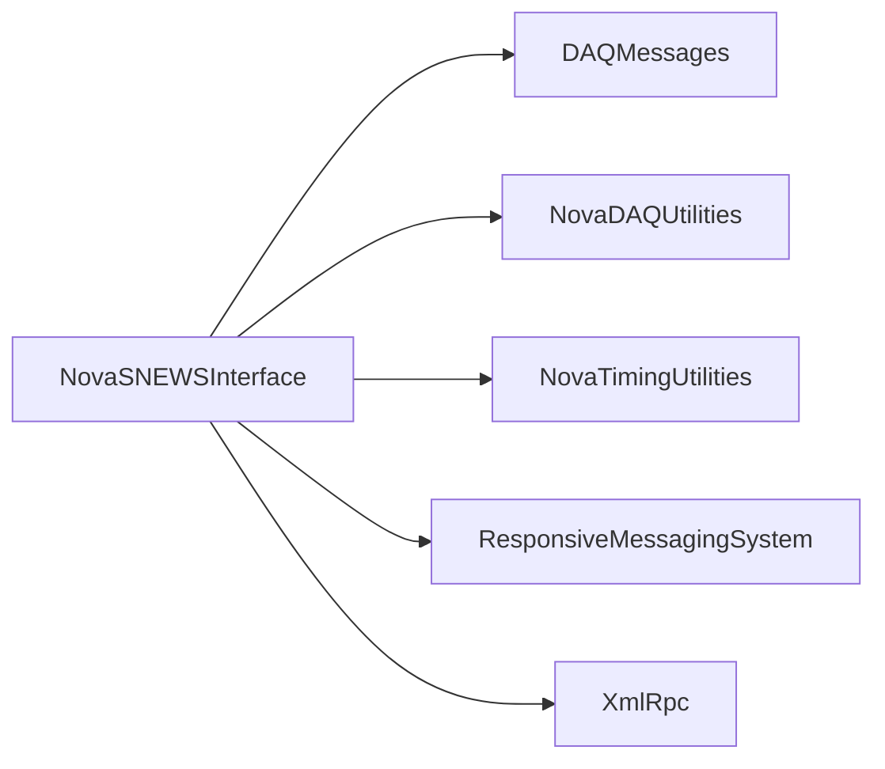

# NovaSNEWSInterface

SNEWS sender, XML-RPC forwarder/receiver, and DDS bridge to the global trigger.

## Identity and scope

Repository: [NovaDAQ/NovaSNEWSInterface](https://github.com/NovaDAQ/NovaSNEWSInterface) · Reviewed commit: `048a0a1b2c6a60c9bf15372a7a11c8da471dd29c` · Domain: **Timing and triggers**.

Tracked files: **29**. Production deployment and owner are **unconfirmed**.

## Operation

Configure receiving/forwarding ports, detector association, and DDS partition explicitly. Check subscription registration, message timestamp interpretation, and downstream trigger delivery using test messages in isolation.

For prerequisites, safe start/stop sequencing, health checks, and rollback see the [operations guide](../operations/index.md).

## Build and integration

This package uses the SRT/SoftRelTools release context. A standalone `make` in a fresh checkout is not a supported build recipe unless the required context is already configured. See [build and release](../operations/build.md).

CMake definitions are present. Most NOvA fragments use parent-provided cetbuildtools macros and dependency targets; consult the files below before treating this directory as a standalone CMake project.

| Build definition |
| --- |
| [CMakeLists.txt](https://github.com/NovaDAQ/NovaSNEWSInterface/blob/048a0a1b2c6a60c9bf15372a7a11c8da471dd29c/CMakeLists.txt) |
| [GNUmakefile](https://github.com/NovaDAQ/NovaSNEWSInterface/blob/048a0a1b2c6a60c9bf15372a7a11c8da471dd29c/GNUmakefile) |
| [cxx/CMakeLists.txt](https://github.com/NovaDAQ/NovaSNEWSInterface/blob/048a0a1b2c6a60c9bf15372a7a11c8da471dd29c/cxx/CMakeLists.txt) |
| [cxx/GNUmakefile](https://github.com/NovaDAQ/NovaSNEWSInterface/blob/048a0a1b2c6a60c9bf15372a7a11c8da471dd29c/cxx/GNUmakefile) |
| [cxx/src/CMakeLists.txt](https://github.com/NovaDAQ/NovaSNEWSInterface/blob/048a0a1b2c6a60c9bf15372a7a11c8da471dd29c/cxx/src/CMakeLists.txt) |
| [cxx/src/GNUmakefile](https://github.com/NovaDAQ/NovaSNEWSInterface/blob/048a0a1b2c6a60c9bf15372a7a11c8da471dd29c/cxx/src/GNUmakefile) |
| [cxx/test/GNUmakefile](https://github.com/NovaDAQ/NovaSNEWSInterface/blob/048a0a1b2c6a60c9bf15372a7a11c8da471dd29c/cxx/test/GNUmakefile) |

## Entry points

These are source entry points or operational scripts found statically. Installation names and enabled targets depend on the build/configuration; listing a script does not establish that it is deployed.

| Source |
| --- |
| [cxx/src/SNEWSMessageForwarder.cc](https://github.com/NovaDAQ/NovaSNEWSInterface/blob/048a0a1b2c6a60c9bf15372a7a11c8da471dd29c/cxx/src/SNEWSMessageForwarder.cc) |
| [cxx/src/SNEWSMessageReceiver.cc](https://github.com/NovaDAQ/NovaSNEWSInterface/blob/048a0a1b2c6a60c9bf15372a7a11c8da471dd29c/cxx/src/SNEWSMessageReceiver.cc) |
| [cxx/src/SNEWSMessageSender.cc](https://github.com/NovaDAQ/NovaSNEWSInterface/blob/048a0a1b2c6a60c9bf15372a7a11c8da471dd29c/cxx/src/SNEWSMessageSender.cc) |

## Interfaces

Headers and declared types form the API navigation map. Follow the source for method signatures, ownership, units, and error contracts. Generated DDS/XSD types are built from the schemas in the next section.

| Header | Declared types |
| --- | --- |
| [cxx/include/SNEWSMessageForwarderConfig.h](https://github.com/NovaDAQ/NovaSNEWSInterface/blob/048a0a1b2c6a60c9bf15372a7a11c8da471dd29c/cxx/include/SNEWSMessageForwarderConfig.h) | `DestinationType`, `SNEWSDestinationSetType`, `SNEWSDestinationType`, `SNEWSMessageForwarderConfigSet`, `SNEWSMessageForwarderConfigType`, `SNEWSSourceType`, `SNEWSTypeSetType`, `SNEWSTypeType` |
| [cxx/include/SNEWSMessageInfo.h](https://github.com/NovaDAQ/NovaSNEWSInterface/blob/048a0a1b2c6a60c9bf15372a7a11c8da471dd29c/cxx/include/SNEWSMessageInfo.h) | `MessageType`, `SNEWSMessageInfo` |
| [cxx/include/SNEWSSenderConfig.h](https://github.com/NovaDAQ/NovaSNEWSInterface/blob/048a0a1b2c6a60c9bf15372a7a11c8da471dd29c/cxx/include/SNEWSSenderConfig.h) | `SNEWSDestinationType`, `SNEWSMessageDestinationType`, `SNEWSMessageTypeSetType`, `SNEWSMessageTypeType`, `SNEWSSenderConfigType` |
| [cxx/include/SNEWSUtil.h](https://github.com/NovaDAQ/NovaSNEWSInterface/blob/048a0a1b2c6a60c9bf15372a7a11c8da471dd29c/cxx/include/SNEWSUtil.h) | `SNEWSUtil` |
| [cxx/include/SNEWSXmlRpcServerClasses.h](https://github.com/NovaDAQ/NovaSNEWSInterface/blob/048a0a1b2c6a60c9bf15372a7a11c8da471dd29c/cxx/include/SNEWSXmlRpcServerClasses.h) | `Dest`, `DestList`, `DestinationAdd`, `DestinationRemove`, `SNEWSMessage`, `SNEWSMessageForward` |
| [cxx/include/daemon_init.h](https://github.com/NovaDAQ/NovaSNEWSInterface/blob/048a0a1b2c6a60c9bf15372a7a11c8da471dd29c/cxx/include/daemon_init.h) | Functions, constants, or templates |

## Configuration and data contracts

| Source artifact |
| --- |
| [config/SNEWSMessageForwarderConfig-AshRiver.xml](https://github.com/NovaDAQ/NovaSNEWSInterface/blob/048a0a1b2c6a60c9bf15372a7a11c8da471dd29c/config/SNEWSMessageForwarderConfig-AshRiver.xml) |
| [config/SNEWSMessageForwarderConfig.xml](https://github.com/NovaDAQ/NovaSNEWSInterface/blob/048a0a1b2c6a60c9bf15372a7a11c8da471dd29c/config/SNEWSMessageForwarderConfig.xml) |
| [config/SNEWSMessageForwarderConfig.xsd](https://github.com/NovaDAQ/NovaSNEWSInterface/blob/048a0a1b2c6a60c9bf15372a7a11c8da471dd29c/config/SNEWSMessageForwarderConfig.xsd) |
| [config/SNEWSSenderConfig.xml](https://github.com/NovaDAQ/NovaSNEWSInterface/blob/048a0a1b2c6a60c9bf15372a7a11c8da471dd29c/config/SNEWSSenderConfig.xml) |
| [config/SNEWSSenderConfig.xsd](https://github.com/NovaDAQ/NovaSNEWSInterface/blob/048a0a1b2c6a60c9bf15372a7a11c8da471dd29c/config/SNEWSSenderConfig.xsd) |

## Environment and external dependencies

Environment names below are literal lookups found in source, not a guarantee that every value is mandatory. No environment values or credentials are copied into this documentation.

No literal environment lookup was identified by this scan; shell setup scripts may still provide required values.

Unresolved/non-package include roots (some are system or generated headers; this is not a package-manager lockfile):

| Include root | Evidence |
| --- | --- |
| `boost` | [cxx/src/SNEWSMessageForwarder.cc:34](https://github.com/NovaDAQ/NovaSNEWSInterface/blob/048a0a1b2c6a60c9bf15372a7a11c8da471dd29c/cxx/src/SNEWSMessageForwarder.cc#L34) |
| `messagefacility` | [cxx/src/SNEWSMessageForwarder.cc:30](https://github.com/NovaDAQ/NovaSNEWSInterface/blob/048a0a1b2c6a60c9bf15372a7a11c8da471dd29c/cxx/src/SNEWSMessageForwarder.cc#L30) |
| `sys` | [cxx/src/SNEWSMessageForwarder.cc:26](https://github.com/NovaDAQ/NovaSNEWSInterface/blob/048a0a1b2c6a60c9bf15372a7a11c8da471dd29c/cxx/src/SNEWSMessageForwarder.cc#L26) |
| `xercesc` | [cxx/include/SNEWSMessageForwarderConfig.h:939](https://github.com/NovaDAQ/NovaSNEWSInterface/blob/048a0a1b2c6a60c9bf15372a7a11c8da471dd29c/cxx/include/SNEWSMessageForwarderConfig.h#L939) |
| `xsd` | [cxx/include/SNEWSMessageForwarderConfig.h:42](https://github.com/NovaDAQ/NovaSNEWSInterface/blob/048a0a1b2c6a60c9bf15372a7a11c8da471dd29c/cxx/include/SNEWSMessageForwarderConfig.h#L42) |

## Package dependencies

Arrow direction is **consumer → dependency**. This diagram includes source/build/runtime relationships and excludes test-only, release-membership, and build-tool edges. Conditional branches are not evaluated.

| Dependency | Relationship | Evidence |
| --- | --- | --- |
| [DAQMessages](DAQMessages.md) | source include | [cxx/include/SNEWSXmlRpcServerClasses.h:23](https://github.com/NovaDAQ/NovaSNEWSInterface/blob/048a0a1b2c6a60c9bf15372a7a11c8da471dd29c/cxx/include/SNEWSXmlRpcServerClasses.h#L23) |
| [NovaDAQUtilities](NovaDAQUtilities.md) | source include | [cxx/include/SNEWSMessageForwarderConfig.h:98](https://github.com/NovaDAQ/NovaSNEWSInterface/blob/048a0a1b2c6a60c9bf15372a7a11c8da471dd29c/cxx/include/SNEWSMessageForwarderConfig.h#L98) |
| [NovaTimingUtilities](NovaTimingUtilities.md) | build link | [cxx/src/CMakeLists.txt:29](https://github.com/NovaDAQ/NovaSNEWSInterface/blob/048a0a1b2c6a60c9bf15372a7a11c8da471dd29c/cxx/src/CMakeLists.txt#L29) |
| [NovaTimingUtilities](NovaTimingUtilities.md) | source include | [cxx/src/SNEWSMessageSender.cc:28](https://github.com/NovaDAQ/NovaSNEWSInterface/blob/048a0a1b2c6a60c9bf15372a7a11c8da471dd29c/cxx/src/SNEWSMessageSender.cc#L28) |
| [NovaTimingUtilities](NovaTimingUtilities.md) | test include | [cxx/test/SNEWSTestSender.cc:3](https://github.com/NovaDAQ/NovaSNEWSInterface/blob/048a0a1b2c6a60c9bf15372a7a11c8da471dd29c/cxx/test/SNEWSTestSender.cc#L3) |
| [NovaTimingUtilities](NovaTimingUtilities.md) | test link | [cxx/test/GNUmakefile:11](https://github.com/NovaDAQ/NovaSNEWSInterface/blob/048a0a1b2c6a60c9bf15372a7a11c8da471dd29c/cxx/test/GNUmakefile#L11) |
| [ResponsiveMessagingSystem](ResponsiveMessagingSystem.md) | build link | [cxx/src/CMakeLists.txt:31](https://github.com/NovaDAQ/NovaSNEWSInterface/blob/048a0a1b2c6a60c9bf15372a7a11c8da471dd29c/cxx/src/CMakeLists.txt#L31) |
| [ResponsiveMessagingSystem](ResponsiveMessagingSystem.md) | source include | [cxx/include/SNEWSXmlRpcServerClasses.h:19](https://github.com/NovaDAQ/NovaSNEWSInterface/blob/048a0a1b2c6a60c9bf15372a7a11c8da471dd29c/cxx/include/SNEWSXmlRpcServerClasses.h#L19) |
| [SRT_ONLINE](SRT_ONLINE.md) | build tool | [GNUmakefile:10](https://github.com/NovaDAQ/NovaSNEWSInterface/blob/048a0a1b2c6a60c9bf15372a7a11c8da471dd29c/GNUmakefile#L10) |
| [XmlRpc](XmlRpc.md) | source include | [cxx/include/SNEWSXmlRpcServerClasses.h:18](https://github.com/NovaDAQ/NovaSNEWSInterface/blob/048a0a1b2c6a60c9bf15372a7a11c8da471dd29c/cxx/include/SNEWSXmlRpcServerClasses.h#L18) |
| [XmlRpc](XmlRpc.md) | test include | [cxx/test/SNEWSTestSender.cc:2](https://github.com/NovaDAQ/NovaSNEWSInterface/blob/048a0a1b2c6a60c9bf15372a7a11c8da471dd29c/cxx/test/SNEWSTestSender.cc#L2) |

Direct consumers: [NovaGlobalTrigger](NovaGlobalTrigger.md).

Explore upstream/downstream impact in the [dependency explorer](../architecture/explorer.md).

## Validation and review

Static analysis attempted **10 C/C++ translation units**, **0 shell scripts**, and parsed **0 Python files**. Counts are tool input coverage, not proof of successful compilation or exhaustive review. Source/build/configuration inventories and the operating surface were also assessed.

No actionable defect was confirmed for this package in this review. This is a bounded review result, not a clean bill of health; unvalidated analyzer diagnostics were not filed as bugs.

Existing test/example sources (not executed against production):

| Source |
| --- |
| [cxx/test/SNEWSTestSender.cc](https://github.com/NovaDAQ/NovaSNEWSInterface/blob/048a0a1b2c6a60c9bf15372a7a11c8da471dd29c/cxx/test/SNEWSTestSender.cc) |

## Existing documentation

No package README/manual identified in the scoped inventory. Use this page and the source interfaces above.
