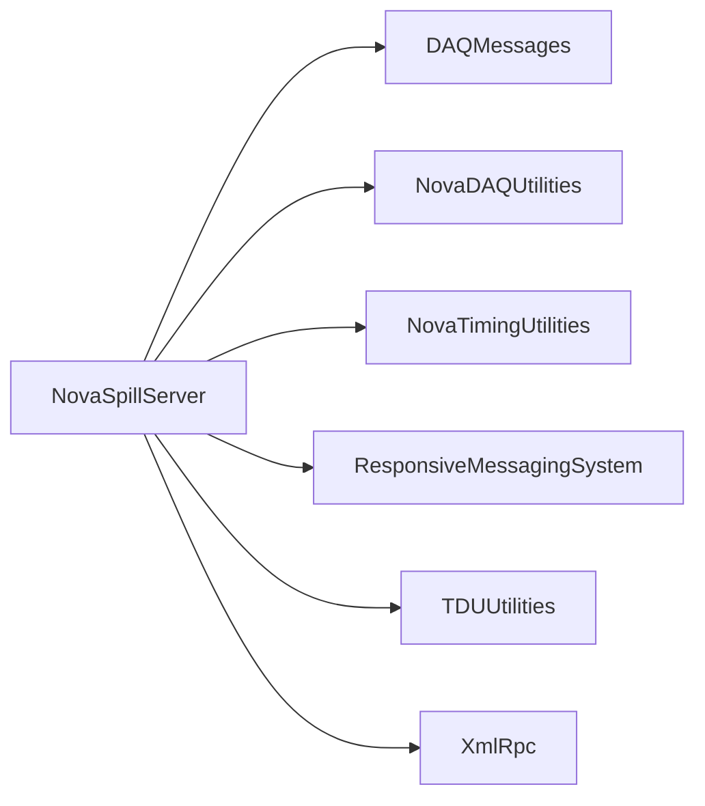

# NovaSpillServer

Beam-spill/TCR receiver, forwarder, XML-RPC/DDS bridge, and TDU timing utilities.

## Identity and scope

Repository: [NovaDAQ/NovaSpillServer](https://github.com/NovaDAQ/NovaSpillServer) · Reviewed commit: `01556087270584a079b16d996e512b26b4f3d534` · Domain: **Timing and triggers**.

Tracked files: **42**. Production deployment and owner are **unconfirmed**.

## Operation

Verify spill source, receiver/forwarder registration, GPS/NOvA timestamp conversion, and destination partitions. Monitor last-spill age and disagreement with current time before enabling spill-driven triggering.

For prerequisites, safe start/stop sequencing, health checks, and rollback see the [operations guide](../operations/index.md).

## Build and integration

This package uses the SRT/SoftRelTools release context. A standalone `make` in a fresh checkout is not a supported build recipe unless the required context is already configured. See [build and release](../operations/build.md).

CMake definitions are present. Most NOvA fragments use parent-provided cetbuildtools macros and dependency targets; consult the files below before treating this directory as a standalone CMake project.

| Build definition |
| --- |
| [CMakeLists.txt](https://github.com/NovaDAQ/NovaSpillServer/blob/01556087270584a079b16d996e512b26b4f3d534/CMakeLists.txt) |
| [GNUmakefile](https://github.com/NovaDAQ/NovaSpillServer/blob/01556087270584a079b16d996e512b26b4f3d534/GNUmakefile) |
| [cxx/CMakeLists.txt](https://github.com/NovaDAQ/NovaSpillServer/blob/01556087270584a079b16d996e512b26b4f3d534/cxx/CMakeLists.txt) |
| [cxx/GNUmakefile](https://github.com/NovaDAQ/NovaSpillServer/blob/01556087270584a079b16d996e512b26b4f3d534/cxx/GNUmakefile) |
| [cxx/src/CMakeLists.txt](https://github.com/NovaDAQ/NovaSpillServer/blob/01556087270584a079b16d996e512b26b4f3d534/cxx/src/CMakeLists.txt) |
| [cxx/src/GNUmakefile](https://github.com/NovaDAQ/NovaSpillServer/blob/01556087270584a079b16d996e512b26b4f3d534/cxx/src/GNUmakefile) |
| [cxx/test/GNUmakefile](https://github.com/NovaDAQ/NovaSpillServer/blob/01556087270584a079b16d996e512b26b4f3d534/cxx/test/GNUmakefile) |
| [cxx/unittest/GNUmakefile](https://github.com/NovaDAQ/NovaSpillServer/blob/01556087270584a079b16d996e512b26b4f3d534/cxx/unittest/GNUmakefile) |
| [java/GNUmakefile](https://github.com/NovaDAQ/NovaSpillServer/blob/01556087270584a079b16d996e512b26b4f3d534/java/GNUmakefile) |
| [java/src/GNUmakefile](https://github.com/NovaDAQ/NovaSpillServer/blob/01556087270584a079b16d996e512b26b4f3d534/java/src/GNUmakefile) |
| [java/test/GNUmakefile](https://github.com/NovaDAQ/NovaSpillServer/blob/01556087270584a079b16d996e512b26b4f3d534/java/test/GNUmakefile) |
| [java/unittest/GNUmakefile](https://github.com/NovaDAQ/NovaSpillServer/blob/01556087270584a079b16d996e512b26b4f3d534/java/unittest/GNUmakefile) |

## Entry points

These are source entry points or operational scripts found statically. Installation names and enabled targets depend on the build/configuration; listing a script does not establish that it is deployed.

| Source |
| --- |
| [cxx/src/NssSpillForwarder.cc](https://github.com/NovaDAQ/NovaSpillServer/blob/01556087270584a079b16d996e512b26b4f3d534/cxx/src/NssSpillForwarder.cc) |
| [cxx/src/NssSpillReceiver.cc](https://github.com/NovaDAQ/NovaSpillServer/blob/01556087270584a079b16d996e512b26b4f3d534/cxx/src/NssSpillReceiver.cc) |
| [cxx/src/NssSpillReceiverEavesDropper.cc](https://github.com/NovaDAQ/NovaSpillServer/blob/01556087270584a079b16d996e512b26b4f3d534/cxx/src/NssSpillReceiverEavesDropper.cc) |
| [cxx/src/NssStandAloneDecoder.cc](https://github.com/NovaDAQ/NovaSpillServer/blob/01556087270584a079b16d996e512b26b4f3d534/cxx/src/NssStandAloneDecoder.cc) |
| [cxx/src/NssTDUApp.cc](https://github.com/NovaDAQ/NovaSpillServer/blob/01556087270584a079b16d996e512b26b4f3d534/cxx/src/NssTDUApp.cc) |
| [cxx/src/NssTDUGetCurrentTime.cc](https://github.com/NovaDAQ/NovaSpillServer/blob/01556087270584a079b16d996e512b26b4f3d534/cxx/src/NssTDUGetCurrentTime.cc) |
| [cxx/src/SpillServerApp-Standalone.cc](https://github.com/NovaDAQ/NovaSpillServer/blob/01556087270584a079b16d996e512b26b4f3d534/cxx/src/SpillServerApp-Standalone.cc) |
| [cxx/src/TCRMonitor.cc](https://github.com/NovaDAQ/NovaSpillServer/blob/01556087270584a079b16d996e512b26b4f3d534/cxx/src/TCRMonitor.cc) |

## Interfaces

Headers and declared types form the API navigation map. Follow the source for method signatures, ownership, units, and error contracts. Generated DDS/XSD types are built from the schemas in the next section.

| Header | Declared types |
| --- | --- |
| [cxx/include/NssSpillInfo.h](https://github.com/NovaDAQ/NovaSpillServer/blob/01556087270584a079b16d996e512b26b4f3d534/cxx/include/NssSpillInfo.h) | `NssSpillInfo`, `SpillType` |
| [cxx/include/NssTDUAppConf.h](https://github.com/NovaDAQ/NovaSpillServer/blob/01556087270584a079b16d996e512b26b4f3d534/cxx/include/NssTDUAppConf.h) | `NssTDUAppConf` |
| [cxx/include/NssUtil.h](https://github.com/NovaDAQ/NovaSpillServer/blob/01556087270584a079b16d996e512b26b4f3d534/cxx/include/NssUtil.h) | `NssUtil` |
| [cxx/include/NssXmlRpcServerClasses.h](https://github.com/NovaDAQ/NovaSpillServer/blob/01556087270584a079b16d996e512b26b4f3d534/cxx/include/NssXmlRpcServerClasses.h) | `Dest`, `DestList`, `DestinationAdd`, `DestinationRemove`, `Spill`, `SpillForward` |
| [cxx/include/daemon_init.h](https://github.com/NovaDAQ/NovaSpillServer/blob/01556087270584a079b16d996e512b26b4f3d534/cxx/include/daemon_init.h) | Functions, constants, or templates |

## Configuration and data contracts

| Source artifact |
| --- |
| [config/NssSpillForwarderConfig-AshRiver.xml](https://github.com/NovaDAQ/NovaSpillServer/blob/01556087270584a079b16d996e512b26b4f3d534/config/NssSpillForwarderConfig-AshRiver.xml) |
| [config/NssSpillForwarderConfig-TB.xml](https://github.com/NovaDAQ/NovaSpillServer/blob/01556087270584a079b16d996e512b26b4f3d534/config/NssSpillForwarderConfig-TB.xml) |
| [config/NssSpillForwarderConfig.xml](https://github.com/NovaDAQ/NovaSpillServer/blob/01556087270584a079b16d996e512b26b4f3d534/config/NssSpillForwarderConfig.xml) |
| [config/NssSpillForwarderConfig.xsd](https://github.com/NovaDAQ/NovaSpillServer/blob/01556087270584a079b16d996e512b26b4f3d534/config/NssSpillForwarderConfig.xsd) |
| [config/NssTDUAppConfig-Feynman.xml](https://github.com/NovaDAQ/NovaSpillServer/blob/01556087270584a079b16d996e512b26b4f3d534/config/NssTDUAppConfig-Feynman.xml) |
| [config/NssTDUAppConfig-Minos.xml](https://github.com/NovaDAQ/NovaSpillServer/blob/01556087270584a079b16d996e512b26b4f3d534/config/NssTDUAppConfig-Minos.xml) |
| [config/NssTDUAppConfig-ND.xml](https://github.com/NovaDAQ/NovaSpillServer/blob/01556087270584a079b16d996e512b26b4f3d534/config/NssTDUAppConfig-ND.xml) |
| [config/NssTDUAppConfig-TB.xml](https://github.com/NovaDAQ/NovaSpillServer/blob/01556087270584a079b16d996e512b26b4f3d534/config/NssTDUAppConfig-TB.xml) |
| [config/NssTDUAppConfig-TestBeam.xml](https://github.com/NovaDAQ/NovaSpillServer/blob/01556087270584a079b16d996e512b26b4f3d534/config/NssTDUAppConfig-TestBeam.xml) |
| [config/NssTDUAppConfig.xml](https://github.com/NovaDAQ/NovaSpillServer/blob/01556087270584a079b16d996e512b26b4f3d534/config/NssTDUAppConfig.xml) |
| [config/NssTDUAppConfig.xsd](https://github.com/NovaDAQ/NovaSpillServer/blob/01556087270584a079b16d996e512b26b4f3d534/config/NssTDUAppConfig.xsd) |

## Environment and external dependencies

Environment names below are literal lookups found in source, not a guarantee that every value is mandatory. No environment values or credentials are copied into this documentation.

No literal environment lookup was identified by this scan; shell setup scripts may still provide required values.

Unresolved/non-package include roots (some are system or generated headers; this is not a package-manager lockfile):

| Include root | Evidence |
| --- | --- |
| `boost` | [cxx/src/NssSpillForwarder.cc:37](https://github.com/NovaDAQ/NovaSpillServer/blob/01556087270584a079b16d996e512b26b4f3d534/cxx/src/NssSpillForwarder.cc#L37) |
| `messagefacility` | [cxx/src/NssSpillForwarder.cc:28](https://github.com/NovaDAQ/NovaSpillServer/blob/01556087270584a079b16d996e512b26b4f3d534/cxx/src/NssSpillForwarder.cc#L28) |
| `sys` | [cxx/src/NssSpillForwarder.cc:24](https://github.com/NovaDAQ/NovaSpillServer/blob/01556087270584a079b16d996e512b26b4f3d534/cxx/src/NssSpillForwarder.cc#L24) |

## Package dependencies

Arrow direction is **consumer → dependency**. This diagram includes source/build/runtime relationships and excludes test-only, release-membership, and build-tool edges. Conditional branches are not evaluated.

| Dependency | Relationship | Evidence |
| --- | --- | --- |
| [DAQMessages](DAQMessages.md) | build link | [cxx/src/CMakeLists.txt:27](https://github.com/NovaDAQ/NovaSpillServer/blob/01556087270584a079b16d996e512b26b4f3d534/cxx/src/CMakeLists.txt#L27) |
| [DAQMessages](DAQMessages.md) | source include | [cxx/include/NssXmlRpcServerClasses.h:23](https://github.com/NovaDAQ/NovaSpillServer/blob/01556087270584a079b16d996e512b26b4f3d534/cxx/include/NssXmlRpcServerClasses.h#L23) |
| [NovaDAQUtilities](NovaDAQUtilities.md) | source include | [cxx/src/NssSpillForwarder.cc:35](https://github.com/NovaDAQ/NovaSpillServer/blob/01556087270584a079b16d996e512b26b4f3d534/cxx/src/NssSpillForwarder.cc#L35) |
| [NovaTimingUtilities](NovaTimingUtilities.md) | build link | [cxx/src/CMakeLists.txt:26](https://github.com/NovaDAQ/NovaSpillServer/blob/01556087270584a079b16d996e512b26b4f3d534/cxx/src/CMakeLists.txt#L26) |
| [NovaTimingUtilities](NovaTimingUtilities.md) | source include | [cxx/src/NssSpillReceiverEavesDropper.cc:23](https://github.com/NovaDAQ/NovaSpillServer/blob/01556087270584a079b16d996e512b26b4f3d534/cxx/src/NssSpillReceiverEavesDropper.cc#L23) |
| [NovaTimingUtilities](NovaTimingUtilities.md) | test include | [cxx/test/NssFakeSpillSender.cc:5](https://github.com/NovaDAQ/NovaSpillServer/blob/01556087270584a079b16d996e512b26b4f3d534/cxx/test/NssFakeSpillSender.cc#L5) |
| [NovaTimingUtilities](NovaTimingUtilities.md) | test link | [cxx/test/GNUmakefile:11](https://github.com/NovaDAQ/NovaSpillServer/blob/01556087270584a079b16d996e512b26b4f3d534/cxx/test/GNUmakefile#L11) |
| [ResponsiveMessagingSystem](ResponsiveMessagingSystem.md) | build link | [cxx/src/CMakeLists.txt:28](https://github.com/NovaDAQ/NovaSpillServer/blob/01556087270584a079b16d996e512b26b4f3d534/cxx/src/CMakeLists.txt#L28) |
| [ResponsiveMessagingSystem](ResponsiveMessagingSystem.md) | source include | [cxx/include/NssXmlRpcServerClasses.h:19](https://github.com/NovaDAQ/NovaSpillServer/blob/01556087270584a079b16d996e512b26b4f3d534/cxx/include/NssXmlRpcServerClasses.h#L19) |
| [SRT_ONLINE](SRT_ONLINE.md) | build tool | [GNUmakefile:10](https://github.com/NovaDAQ/NovaSpillServer/blob/01556087270584a079b16d996e512b26b4f3d534/GNUmakefile#L10) |
| [TDUUtilities](TDUUtilities.md) | build link | [cxx/src/GNUmakefile:47](https://github.com/NovaDAQ/NovaSpillServer/blob/01556087270584a079b16d996e512b26b4f3d534/cxx/src/GNUmakefile#L47) |
| [TDUUtilities](TDUUtilities.md) | source include | [cxx/src/NssStandAloneDecoder.cc:16](https://github.com/NovaDAQ/NovaSpillServer/blob/01556087270584a079b16d996e512b26b4f3d534/cxx/src/NssStandAloneDecoder.cc#L16) |
| [XmlRpc](XmlRpc.md) | source include | [cxx/include/NssXmlRpcServerClasses.h:18](https://github.com/NovaDAQ/NovaSpillServer/blob/01556087270584a079b16d996e512b26b4f3d534/cxx/include/NssXmlRpcServerClasses.h#L18) |
| [XmlRpc](XmlRpc.md) | test include | [cxx/test/NssFakeSpillSender.cc:4](https://github.com/NovaDAQ/NovaSpillServer/blob/01556087270584a079b16d996e512b26b4f3d534/cxx/test/NssFakeSpillSender.cc#L4) |

Direct consumers: [NovaGlobalTrigger](NovaGlobalTrigger.md), [SHM_Utilities](SHM_Utilities.md), [TDUWeb](TDUWeb.md).

Explore upstream/downstream impact in the [dependency explorer](../architecture/explorer.md).

## Validation and review

Static analysis attempted **13 C/C++ translation units**, **0 shell scripts**, and parsed **0 Python files**. Counts are tool input coverage, not proof of successful compilation or exhaustive review. Source/build/configuration inventories and the operating surface were also assessed.

No actionable defect was confirmed for this package in this review. This is a bounded review result, not a clean bill of health; unvalidated analyzer diagnostics were not filed as bugs.

Existing test/example sources (not executed against production):

| Source |
| --- |
| [cxx/test/NssFakeSpillSender.cc](https://github.com/NovaDAQ/NovaSpillServer/blob/01556087270584a079b16d996e512b26b4f3d534/cxx/test/NssFakeSpillSender.cc) |

## Existing documentation

No package README/manual identified in the scoped inventory. Use this page and the source interfaces above.
