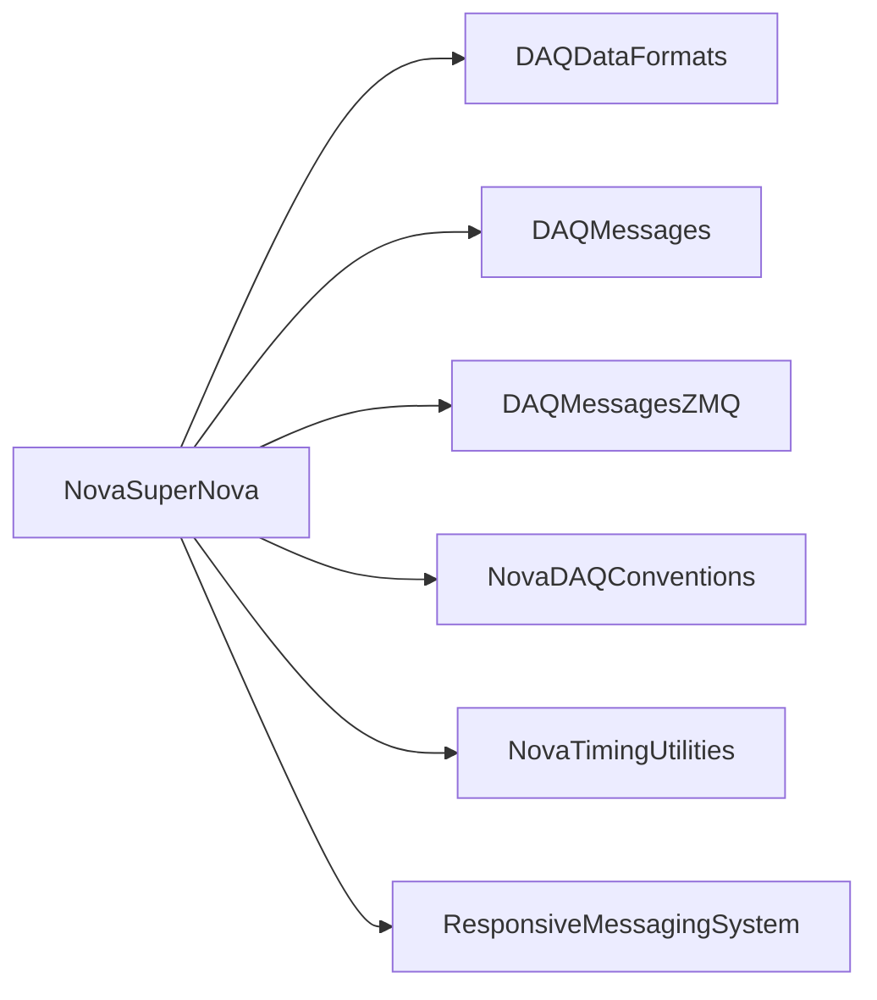

# NovaSuperNova

Buffers hit-rate data, estimates background, processes candidate bursts, logs results, and sends supernova triggers.

## Identity and scope

Repository: [NovaDAQ/NovaSuperNova](https://github.com/NovaDAQ/NovaSuperNova) · Reviewed commit: `7c4518bac39203207cbd750f7fd4c112aaac7558` · Domain: **Timing and triggers**.

Tracked files: **59**. Production deployment and owner are **unconfirmed**.

## Operation

Match binning/time ranges and input endpoints with producers. Monitor input gaps, buffer coverage, background readiness, and outgoing trigger counts. Validate thresholds against captured data in an isolated partition.

For prerequisites, safe start/stop sequencing, health checks, and rollback see the [operations guide](../operations/index.md).

## Build and integration

This package uses the SRT/SoftRelTools release context. A standalone `make` in a fresh checkout is not a supported build recipe unless the required context is already configured. See [build and release](../operations/build.md).

CMake definitions are present. Most NOvA fragments use parent-provided cetbuildtools macros and dependency targets; consult the files below before treating this directory as a standalone CMake project.

| Build definition |
| --- |
| [CMakeLists.txt](https://github.com/NovaDAQ/NovaSuperNova/blob/7c4518bac39203207cbd750f7fd4c112aaac7558/CMakeLists.txt) |
| [GNUmakefile](https://github.com/NovaDAQ/NovaSuperNova/blob/7c4518bac39203207cbd750f7fd4c112aaac7558/GNUmakefile) |
| [cxx/CMakeLists.txt](https://github.com/NovaDAQ/NovaSuperNova/blob/7c4518bac39203207cbd750f7fd4c112aaac7558/cxx/CMakeLists.txt) |
| [cxx/GNUmakefile](https://github.com/NovaDAQ/NovaSuperNova/blob/7c4518bac39203207cbd750f7fd4c112aaac7558/cxx/GNUmakefile) |
| [cxx/src/CMakeLists.txt](https://github.com/NovaDAQ/NovaSuperNova/blob/7c4518bac39203207cbd750f7fd4c112aaac7558/cxx/src/CMakeLists.txt) |
| [cxx/src/GNUmakefile](https://github.com/NovaDAQ/NovaSuperNova/blob/7c4518bac39203207cbd750f7fd4c112aaac7558/cxx/src/GNUmakefile) |
| [cxx/test/CMakeLists.txt](https://github.com/NovaDAQ/NovaSuperNova/blob/7c4518bac39203207cbd750f7fd4c112aaac7558/cxx/test/CMakeLists.txt) |
| [cxx/test/GNUmakefile](https://github.com/NovaDAQ/NovaSuperNova/blob/7c4518bac39203207cbd750f7fd4c112aaac7558/cxx/test/GNUmakefile) |
| [cxx/unittest/CMakeLists.txt](https://github.com/NovaDAQ/NovaSuperNova/blob/7c4518bac39203207cbd750f7fd4c112aaac7558/cxx/unittest/CMakeLists.txt) |
| [cxx/unittest/GNUmakefile](https://github.com/NovaDAQ/NovaSuperNova/blob/7c4518bac39203207cbd750f7fd4c112aaac7558/cxx/unittest/GNUmakefile) |

## Entry points

These are source entry points or operational scripts found statically. Installation names and enabled targets depend on the build/configuration; listing a script does not establish that it is deployed.

| Source |
| --- |
| [script/accumulate_maps.py](https://github.com/NovaDAQ/NovaSuperNova/blob/7c4518bac39203207cbd750f7fd4c112aaac7558/script/accumulate_maps.py) |
| [script/dump_map.py](https://github.com/NovaDAQ/NovaSuperNova/blob/7c4518bac39203207cbd750f7fd4c112aaac7558/script/dump_map.py) |
| [script/map_rollover.sh](https://github.com/NovaDAQ/NovaSuperNova/blob/7c4518bac39203207cbd750f7fd4c112aaac7558/script/map_rollover.sh) |
| [script/plot_map.py](https://github.com/NovaDAQ/NovaSuperNova/blob/7c4518bac39203207cbd750f7fd4c112aaac7558/script/plot_map.py) |

## Interfaces

Headers and declared types form the API navigation map. Follow the source for method signatures, ownership, units, and error contracts. Generated DDS/XSD types are built from the schemas in the next section.

| Header | Declared types |
| --- | --- |
| [cxx/include/BackgroundEstimator.h](https://github.com/NovaDAQ/NovaSuperNova/blob/7c4518bac39203207cbd750f7fd4c112aaac7558/cxx/include/BackgroundEstimator.h) | `BackgroundEstimator`, `BackgroundModel` |
| [cxx/include/BlockingQueue.h](https://github.com/NovaDAQ/NovaSuperNova/blob/7c4518bac39203207cbd750f7fd4c112aaac7558/cxx/include/BlockingQueue.h) | `BlockingQueue`, `DataBlockQueue` |
| [cxx/include/FIRFilter.h](https://github.com/NovaDAQ/NovaSuperNova/blob/7c4518bac39203207cbd750f7fd4c112aaac7558/cxx/include/FIRFilter.h) | `FIRFilter` |
| [cxx/include/FilteredData.h](https://github.com/NovaDAQ/NovaSuperNova/blob/7c4518bac39203207cbd750f7fd4c112aaac7558/cxx/include/FilteredData.h) | `FilteredData` |
| [cxx/include/Histogram.h](https://github.com/NovaDAQ/NovaSuperNova/blob/7c4518bac39203207cbd750f7fd4c112aaac7558/cxx/include/Histogram.h) | `HistDistr`, `Histogram` |
| [cxx/include/IOInterfaces.h](https://github.com/NovaDAQ/NovaSuperNova/blob/7c4518bac39203207cbd750f7fd4c112aaac7558/cxx/include/IOInterfaces.h) | `Conditional`, `InputI`, `OutputI`, `OutputList` |
| [cxx/include/Logger.h](https://github.com/NovaDAQ/NovaSuperNova/blob/7c4518bac39203207cbd750f7fd4c112aaac7558/cxx/include/Logger.h) | `Logger` |
| [cxx/include/NSNInbox.h](https://github.com/NovaDAQ/NovaSuperNova/blob/7c4518bac39203207cbd750f7fd4c112aaac7558/cxx/include/NSNInbox.h) | `NSNInbox` |
| [cxx/include/NamedTrigger.h](https://github.com/NovaDAQ/NovaSuperNova/blob/7c4518bac39203207cbd750f7fd4c112aaac7558/cxx/include/NamedTrigger.h) | `NamedTrigger` |
| [cxx/include/QualityControl.h](https://github.com/NovaDAQ/NovaSuperNova/blob/7c4518bac39203207cbd750f7fd4c112aaac7558/cxx/include/QualityControl.h) | `QualityControl` |
| [cxx/include/SNBase.h](https://github.com/NovaDAQ/NovaSuperNova/blob/7c4518bac39203207cbd750f7fd4c112aaac7558/cxx/include/SNBase.h) | Functions, constants, or templates |
| [cxx/include/SNDataBlock.h](https://github.com/NovaDAQ/NovaSuperNova/blob/7c4518bac39203207cbd750f7fd4c112aaac7558/cxx/include/SNDataBlock.h) | `DataBlock` |
| [cxx/include/SNDataBuffer.h](https://github.com/NovaDAQ/NovaSuperNova/blob/7c4518bac39203207cbd750f7fd4c112aaac7558/cxx/include/SNDataBuffer.h) | `DataBuffer` |
| [cxx/include/SNDataBufferIterator.h](https://github.com/NovaDAQ/NovaSuperNova/blob/7c4518bac39203207cbd750f7fd4c112aaac7558/cxx/include/SNDataBufferIterator.h) | `BufferIterator` |
| [cxx/include/SNExceptions.h](https://github.com/NovaDAQ/NovaSuperNova/blob/7c4518bac39203207cbd750f7fd4c112aaac7558/cxx/include/SNExceptions.h) | `basic_error`, `fill_collision`, `out_of_range` |
| [cxx/include/SNListener.h](https://github.com/NovaDAQ/NovaSuperNova/blob/7c4518bac39203207cbd750f7fd4c112aaac7558/cxx/include/SNListener.h) | `Listener`, `ListenerBase` |
| [cxx/include/SNMessage.h](https://github.com/NovaDAQ/NovaSuperNova/blob/7c4518bac39203207cbd750f7fd4c112aaac7558/cxx/include/SNMessage.h) | `Message` |
| [cxx/include/SNOverrider.h](https://github.com/NovaDAQ/NovaSuperNova/blob/7c4518bac39203207cbd750f7fd4c112aaac7558/cxx/include/SNOverrider.h) | `Overrider` |
| [cxx/include/SNProcessor.h](https://github.com/NovaDAQ/NovaSuperNova/blob/7c4518bac39203207cbd750f7fd4c112aaac7558/cxx/include/SNProcessor.h) | `Processor` |
| [cxx/include/SNVirtualDataBlock.h](https://github.com/NovaDAQ/NovaSuperNova/blob/7c4518bac39203207cbd750f7fd4c112aaac7558/cxx/include/SNVirtualDataBlock.h) | `TimeRange`, `VirtualDataBlock` |
| [cxx/include/Stat.h](https://github.com/NovaDAQ/NovaSuperNova/blob/7c4518bac39203207cbd750f7fd4c112aaac7558/cxx/include/Stat.h) | `LLR`, `LLRBase`, `LLRConv`, `LLRDistr`, `LLRDummy`, `LLRGauss`, `distr_t` |
| [cxx/include/TriggerSender.h](https://github.com/NovaDAQ/NovaSuperNova/blob/7c4518bac39203207cbd750f7fd4c112aaac7558/cxx/include/TriggerSender.h) | `TriggerSender` |
| [cxx/include/TriggerSignal.h](https://github.com/NovaDAQ/NovaSuperNova/blob/7c4518bac39203207cbd750f7fd4c112aaac7558/cxx/include/TriggerSignal.h) | `TriggerSignal` |
| [cxx/include/Util.h](https://github.com/NovaDAQ/NovaSuperNova/blob/7c4518bac39203207cbd750f7fd4c112aaac7558/cxx/include/Util.h) | `log_sb` |
| [cxx/include/ZMQLogger.h](https://github.com/NovaDAQ/NovaSuperNova/blob/7c4518bac39203207cbd750f7fd4c112aaac7558/cxx/include/ZMQLogger.h) | `ZMQLogger` |

## Configuration and data contracts

| Source artifact |
| --- |
| [config/SNEWSSenderConfig.xsd](https://github.com/NovaDAQ/NovaSuperNova/blob/7c4518bac39203207cbd750f7fd4c112aaac7558/config/SNEWSSenderConfig.xsd) |

## Environment and external dependencies

Environment names below are literal lookups found in source, not a guarantee that every value is mandatory. No environment values or credentials are copied into this documentation.

No literal environment lookup was identified by this scan; shell setup scripts may still provide required values.

Unresolved/non-package include roots (some are system or generated headers; this is not a package-manager lockfile):

| Include root | Evidence |
| --- | --- |
| `boost` | [cxx/include/BackgroundEstimator.h:8](https://github.com/NovaDAQ/NovaSuperNova/blob/7c4518bac39203207cbd750f7fd4c112aaac7558/cxx/include/BackgroundEstimator.h#L8) |

## Package dependencies

Arrow direction is **consumer → dependency**. This diagram includes source/build/runtime relationships and excludes test-only, release-membership, and build-tool edges. Conditional branches are not evaluated.

| Dependency | Relationship | Evidence |
| --- | --- | --- |
| [DAQDataFormats](DAQDataFormats.md) | source include | [cxx/src/TriggerSender.cpp:1](https://github.com/NovaDAQ/NovaSuperNova/blob/7c4518bac39203207cbd750f7fd4c112aaac7558/cxx/src/TriggerSender.cpp#L1) |
| [DAQMessages](DAQMessages.md) | build link | [cxx/src/CMakeLists.txt:4](https://github.com/NovaDAQ/NovaSuperNova/blob/7c4518bac39203207cbd750f7fd4c112aaac7558/cxx/src/CMakeLists.txt#L4) |
| [DAQMessages](DAQMessages.md) | test link | [cxx/test/CMakeLists.txt:6](https://github.com/NovaDAQ/NovaSuperNova/blob/7c4518bac39203207cbd750f7fd4c112aaac7558/cxx/test/CMakeLists.txt#L6) |
| [DAQMessagesZMQ](DAQMessagesZMQ.md) | source include | [cxx/include/NSNInbox.h:4](https://github.com/NovaDAQ/NovaSuperNova/blob/7c4518bac39203207cbd750f7fd4c112aaac7558/cxx/include/NSNInbox.h#L4) |
| [DAQMessagesZMQ](DAQMessagesZMQ.md) | test include | [cxx/test/nsn_recv.cc:15](https://github.com/NovaDAQ/NovaSuperNova/blob/7c4518bac39203207cbd750f7fd4c112aaac7558/cxx/test/nsn_recv.cc#L15) |
| [NovaDAQConventions](NovaDAQConventions.md) | source include | [cxx/include/TriggerSender.h:7](https://github.com/NovaDAQ/NovaSuperNova/blob/7c4518bac39203207cbd750f7fd4c112aaac7558/cxx/include/TriggerSender.h#L7) |
| [NovaTimingUtilities](NovaTimingUtilities.md) | build link | [cxx/src/CMakeLists.txt:3](https://github.com/NovaDAQ/NovaSuperNova/blob/7c4518bac39203207cbd750f7fd4c112aaac7558/cxx/src/CMakeLists.txt#L3) |
| [NovaTimingUtilities](NovaTimingUtilities.md) | source include | [cxx/src/TriggerSender.cpp:2](https://github.com/NovaDAQ/NovaSuperNova/blob/7c4518bac39203207cbd750f7fd4c112aaac7558/cxx/src/TriggerSender.cpp#L2) |
| [NovaTimingUtilities](NovaTimingUtilities.md) | test include | [cxx/test/SNReceiver.cc:16](https://github.com/NovaDAQ/NovaSuperNova/blob/7c4518bac39203207cbd750f7fd4c112aaac7558/cxx/test/SNReceiver.cc#L16) |
| [NovaTimingUtilities](NovaTimingUtilities.md) | test link | [cxx/test/CMakeLists.txt:7](https://github.com/NovaDAQ/NovaSuperNova/blob/7c4518bac39203207cbd750f7fd4c112aaac7558/cxx/test/CMakeLists.txt#L7) |
| [ResponsiveMessagingSystem](ResponsiveMessagingSystem.md) | build link | [cxx/src/CMakeLists.txt:5](https://github.com/NovaDAQ/NovaSuperNova/blob/7c4518bac39203207cbd750f7fd4c112aaac7558/cxx/src/CMakeLists.txt#L5) |
| [ResponsiveMessagingSystem](ResponsiveMessagingSystem.md) | test link | [cxx/test/CMakeLists.txt:8](https://github.com/NovaDAQ/NovaSuperNova/blob/7c4518bac39203207cbd750f7fd4c112aaac7558/cxx/test/CMakeLists.txt#L8) |
| [SRT_ONLINE](SRT_ONLINE.md) | build tool | [GNUmakefile:11](https://github.com/NovaDAQ/NovaSuperNova/blob/7c4518bac39203207cbd750f7fd4c112aaac7558/GNUmakefile#L11) |

Direct consumers: [NovaGlobalTrigger](NovaGlobalTrigger.md).

Explore upstream/downstream impact in the [dependency explorer](../architecture/explorer.md).

## Validation and review

Static analysis attempted **18 C/C++ translation units**, **1 shell scripts**, and parsed **3 Python files**. Counts are tool input coverage, not proof of successful compilation or exhaustive review. Source/build/configuration inventories and the operating surface were also assessed.

No actionable defect was confirmed for this package in this review. This is a bounded review result, not a clean bill of health; unvalidated analyzer diagnostics were not filed as bugs.

Existing test/example sources (not executed against production):

| Source |
| --- |
| [cxx/test/SNReceiver.cc](https://github.com/NovaDAQ/NovaSuperNova/blob/7c4518bac39203207cbd750f7fd4c112aaac7558/cxx/test/SNReceiver.cc) |
| [cxx/test/nsn_check_data.cc](https://github.com/NovaDAQ/NovaSuperNova/blob/7c4518bac39203207cbd750f7fd4c112aaac7558/cxx/test/nsn_check_data.cc) |
| [cxx/test/nsn_recv.cc](https://github.com/NovaDAQ/NovaSuperNova/blob/7c4518bac39203207cbd750f7fd4c112aaac7558/cxx/test/nsn_recv.cc) |
| [cxx/test/nsn_send.cc](https://github.com/NovaDAQ/NovaSuperNova/blob/7c4518bac39203207cbd750f7fd4c112aaac7558/cxx/test/nsn_send.cc) |
| [cxx/unittest/testFilter.cc](https://github.com/NovaDAQ/NovaSuperNova/blob/7c4518bac39203207cbd750f7fd4c112aaac7558/cxx/unittest/testFilter.cc) |
| [cxx/unittest/testHistogram.cc](https://github.com/NovaDAQ/NovaSuperNova/blob/7c4518bac39203207cbd750f7fd4c112aaac7558/cxx/unittest/testHistogram.cc) |
| [cxx/unittest/testSNBlock.cc](https://github.com/NovaDAQ/NovaSuperNova/blob/7c4518bac39203207cbd750f7fd4c112aaac7558/cxx/unittest/testSNBlock.cc) |
| [cxx/unittest/testSNBuffer.cc](https://github.com/NovaDAQ/NovaSuperNova/blob/7c4518bac39203207cbd750f7fd4c112aaac7558/cxx/unittest/testSNBuffer.cc) |
| [cxx/unittest/testSNQueue.cc](https://github.com/NovaDAQ/NovaSuperNova/blob/7c4518bac39203207cbd750f7fd4c112aaac7558/cxx/unittest/testSNQueue.cc) |
| [cxx/unittest/testStat.cc](https://github.com/NovaDAQ/NovaSuperNova/blob/7c4518bac39203207cbd750f7fd4c112aaac7558/cxx/unittest/testStat.cc) |

## Existing documentation

No package README/manual identified in the scoped inventory. Use this page and the source interfaces above.
