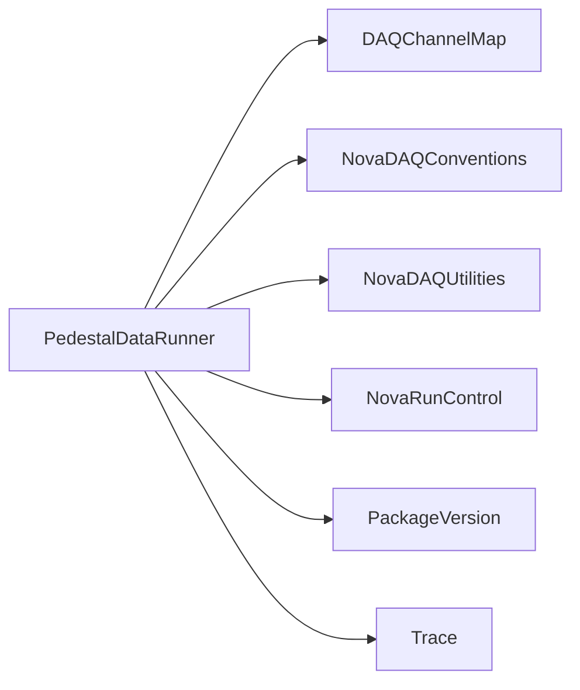

# PedestalDataRunner

GUI/CLI DSO acquisition, selection, reprocessing, and pedestal-analysis workflow.

## Identity and scope

Repository: [NovaDAQ/PedestalDataRunner](https://github.com/NovaDAQ/PedestalDataRunner) · Reviewed commit: `f0bb80529c026ef2eae3baf0f6beca72fe89db62` · Domain: **Hardware**.

Tracked files: **74**. Production deployment and owner are **unconfirmed**.

## Operation

Choose detector/DCMs and acquisition settings explicitly, check output paths, and avoid overlapping hardware readout. Preserve raw DSO input separately from derived plots/thresholds and verify configuration before applying results.

For prerequisites, safe start/stop sequencing, health checks, and rollback see the [operations guide](../operations/index.md).

## Build and integration

This package uses the SRT/SoftRelTools release context. A standalone `make` in a fresh checkout is not a supported build recipe unless the required context is already configured. See [build and release](../operations/build.md).

| Build definition |
| --- |
| [GNUmakefile](https://github.com/NovaDAQ/PedestalDataRunner/blob/f0bb80529c026ef2eae3baf0f6beca72fe89db62/GNUmakefile) |
| [cxx/GNUmakefile](https://github.com/NovaDAQ/PedestalDataRunner/blob/f0bb80529c026ef2eae3baf0f6beca72fe89db62/cxx/GNUmakefile) |
| [cxx/src/DSOReprocessor/GNUmakefile](https://github.com/NovaDAQ/PedestalDataRunner/blob/f0bb80529c026ef2eae3baf0f6beca72fe89db62/cxx/src/DSOReprocessor/GNUmakefile) |
| [cxx/src/GNUmakefile](https://github.com/NovaDAQ/PedestalDataRunner/blob/f0bb80529c026ef2eae3baf0f6beca72fe89db62/cxx/src/GNUmakefile) |
| [cxx/src/PedestalDataRunner.pro](https://github.com/NovaDAQ/PedestalDataRunner/blob/f0bb80529c026ef2eae3baf0f6beca72fe89db62/cxx/src/PedestalDataRunner.pro) |
| [cxx/test/GNUmakefile](https://github.com/NovaDAQ/PedestalDataRunner/blob/f0bb80529c026ef2eae3baf0f6beca72fe89db62/cxx/test/GNUmakefile) |
| [cxx/unittest/GNUmakefile](https://github.com/NovaDAQ/PedestalDataRunner/blob/f0bb80529c026ef2eae3baf0f6beca72fe89db62/cxx/unittest/GNUmakefile) |
| [script/GNUmakefile](https://github.com/NovaDAQ/PedestalDataRunner/blob/f0bb80529c026ef2eae3baf0f6beca72fe89db62/script/GNUmakefile) |

## Entry points

These are source entry points or operational scripts found statically. Installation names and enabled targets depend on the build/configuration; listing a script does not establish that it is deployed.

| Source |
| --- |
| [cxx/src/DSOReprocessor/dcmReprocess.py](https://github.com/NovaDAQ/PedestalDataRunner/blob/f0bb80529c026ef2eae3baf0f6beca72fe89db62/cxx/src/DSOReprocessor/dcmReprocess.py) |
| [cxx/src/DSOReprocessor/pedestaldatarunner_reprocess.cc](https://github.com/NovaDAQ/PedestalDataRunner/blob/f0bb80529c026ef2eae3baf0f6beca72fe89db62/cxx/src/DSOReprocessor/pedestaldatarunner_reprocess.cc) |
| [cxx/src/dsoselect.cc](https://github.com/NovaDAQ/PedestalDataRunner/blob/f0bb80529c026ef2eae3baf0f6beca72fe89db62/cxx/src/dsoselect.cc) |
| [cxx/src/pedestaldatarunner.cc](https://github.com/NovaDAQ/PedestalDataRunner/blob/f0bb80529c026ef2eae3baf0f6beca72fe89db62/cxx/src/pedestaldatarunner.cc) |
| [script/compare.py](https://github.com/NovaDAQ/PedestalDataRunner/blob/f0bb80529c026ef2eae3baf0f6beca72fe89db62/script/compare.py) |
| [script/createBaseDirectory.sh](https://github.com/NovaDAQ/PedestalDataRunner/blob/f0bb80529c026ef2eae3baf0f6beca72fe89db62/script/createBaseDirectory.sh) |
| [script/startDCMPedestal.sh](https://github.com/NovaDAQ/PedestalDataRunner/blob/f0bb80529c026ef2eae3baf0f6beca72fe89db62/script/startDCMPedestal.sh) |
| [script/startDCMPedestalConfigure.sh](https://github.com/NovaDAQ/PedestalDataRunner/blob/f0bb80529c026ef2eae3baf0f6beca72fe89db62/script/startDCMPedestalConfigure.sh) |
| [script/startDCMPedestalTakeData.sh](https://github.com/NovaDAQ/PedestalDataRunner/blob/f0bb80529c026ef2eae3baf0f6beca72fe89db62/script/startDCMPedestalTakeData.sh) |
| [script/startDCMPedestal_teststand.sh](https://github.com/NovaDAQ/PedestalDataRunner/blob/f0bb80529c026ef2eae3baf0f6beca72fe89db62/script/startDCMPedestal_teststand.sh) |
| [script/startDCMTemperatureReadout.sh](https://github.com/NovaDAQ/PedestalDataRunner/blob/f0bb80529c026ef2eae3baf0f6beca72fe89db62/script/startDCMTemperatureReadout.sh) |
| [script/startDCMTemperatureReadout_teststand.sh](https://github.com/NovaDAQ/PedestalDataRunner/blob/f0bb80529c026ef2eae3baf0f6beca72fe89db62/script/startDCMTemperatureReadout_teststand.sh) |
| [script/startReprocess.sh](https://github.com/NovaDAQ/PedestalDataRunner/blob/f0bb80529c026ef2eae3baf0f6beca72fe89db62/script/startReprocess.sh) |
| [script/startReprocessTemperatureReadout.sh](https://github.com/NovaDAQ/PedestalDataRunner/blob/f0bb80529c026ef2eae3baf0f6beca72fe89db62/script/startReprocessTemperatureReadout.sh) |
| [script/startReprocess_teststand.sh](https://github.com/NovaDAQ/PedestalDataRunner/blob/f0bb80529c026ef2eae3baf0f6beca72fe89db62/script/startReprocess_teststand.sh) |

## Interfaces

Headers and declared types form the API navigation map. Follow the source for method signatures, ownership, units, and error contracts. Generated DDS/XSD types are built from the schemas in the next section.

| Header | Declared types |
| --- | --- |
| [cxx/include/AboutDialog.h](https://github.com/NovaDAQ/PedestalDataRunner/blob/f0bb80529c026ef2eae3baf0f6beca72fe89db62/cxx/include/AboutDialog.h) | `AboutDialog` |
| [cxx/include/CommandLineParser.h](https://github.com/NovaDAQ/PedestalDataRunner/blob/f0bb80529c026ef2eae3baf0f6beca72fe89db62/cxx/include/CommandLineParser.h) | `CommandLineParser`, `Configuration` |
| [cxx/include/Configuration.h](https://github.com/NovaDAQ/PedestalDataRunner/blob/f0bb80529c026ef2eae3baf0f6beca72fe89db62/cxx/include/Configuration.h) | `Configuration`, `LoadXML`, `UserMode`, `WhereDoWeRun`, `WhoAMI` |
| [cxx/include/DCMWidget.h](https://github.com/NovaDAQ/PedestalDataRunner/blob/f0bb80529c026ef2eae3baf0f6beca72fe89db62/cxx/include/DCMWidget.h) | `DCMWidget` |
| [cxx/include/DSOOverviewWidget.h](https://github.com/NovaDAQ/PedestalDataRunner/blob/f0bb80529c026ef2eae3baf0f6beca72fe89db62/cxx/include/DSOOverviewWidget.h) | `DSOOverviewWidget` |
| [cxx/include/DSOReadoutStates.h](https://github.com/NovaDAQ/PedestalDataRunner/blob/f0bb80529c026ef2eae3baf0f6beca72fe89db62/cxx/include/DSOReadoutStates.h) | `ReadoutState` |
| [cxx/include/DSOReprocessor/CanvasManager.h](https://github.com/NovaDAQ/PedestalDataRunner/blob/f0bb80529c026ef2eae3baf0f6beca72fe89db62/cxx/include/DSOReprocessor/CanvasManager.h) | `CanvasManager` |
| [cxx/include/DSOReprocessor/DSOConfiguration.h](https://github.com/NovaDAQ/PedestalDataRunner/blob/f0bb80529c026ef2eae3baf0f6beca72fe89db62/cxx/include/DSOReprocessor/DSOConfiguration.h) | `DSOConfiguration` |
| [cxx/include/DSOReprocessor/PedestalAnalizer.h](https://github.com/NovaDAQ/PedestalDataRunner/blob/f0bb80529c026ef2eae3baf0f6beca72fe89db62/cxx/include/DSOReprocessor/PedestalAnalizer.h) | `PedestalAnalizer` |
| [cxx/include/DSOReprocessor/PedestalUtilities.h](https://github.com/NovaDAQ/PedestalDataRunner/blob/f0bb80529c026ef2eae3baf0f6beca72fe89db62/cxx/include/DSOReprocessor/PedestalUtilities.h) | `PedestalUtilities` |
| [cxx/include/DSOSelect.h](https://github.com/NovaDAQ/PedestalDataRunner/blob/f0bb80529c026ef2eae3baf0f6beca72fe89db62/cxx/include/DSOSelect.h) | `DSOSelect` |
| [cxx/include/DiblockWidget.h](https://github.com/NovaDAQ/PedestalDataRunner/blob/f0bb80529c026ef2eae3baf0f6beca72fe89db62/cxx/include/DiblockWidget.h) | `DiblockWidget` |
| [cxx/include/DirectoryManager.h](https://github.com/NovaDAQ/PedestalDataRunner/blob/f0bb80529c026ef2eae3baf0f6beca72fe89db62/cxx/include/DirectoryManager.h) | `DirectoryManager` |
| [cxx/include/GroupOfDCMs.h](https://github.com/NovaDAQ/PedestalDataRunner/blob/f0bb80529c026ef2eae3baf0f6beca72fe89db62/cxx/include/GroupOfDCMs.h) | `GroupOfDCMs` |
| [cxx/include/GroupOfDiblocks.h](https://github.com/NovaDAQ/PedestalDataRunner/blob/f0bb80529c026ef2eae3baf0f6beca72fe89db62/cxx/include/GroupOfDiblocks.h) | `GroupOfDiblocks` |
| [cxx/include/NormalThread.h](https://github.com/NovaDAQ/PedestalDataRunner/blob/f0bb80529c026ef2eae3baf0f6beca72fe89db62/cxx/include/NormalThread.h) | `NormalThread`, `ThreadType` |
| [cxx/include/PedestalDataRunner.h](https://github.com/NovaDAQ/PedestalDataRunner/blob/f0bb80529c026ef2eae3baf0f6beca72fe89db62/cxx/include/PedestalDataRunner.h) | `GoMode`, `PedestalDataRunner` |
| [cxx/include/PowerManager.h](https://github.com/NovaDAQ/PedestalDataRunner/blob/f0bb80529c026ef2eae3baf0f6beca72fe89db62/cxx/include/PowerManager.h) | `PowerManager` |
| [cxx/include/Reprocess.h](https://github.com/NovaDAQ/PedestalDataRunner/blob/f0bb80529c026ef2eae3baf0f6beca72fe89db62/cxx/include/Reprocess.h) | `Reprocess` |
| [cxx/include/Utilities.h](https://github.com/NovaDAQ/PedestalDataRunner/blob/f0bb80529c026ef2eae3baf0f6beca72fe89db62/cxx/include/Utilities.h) | `ErrorLogs` |
| [cxx/include/version.h](https://github.com/NovaDAQ/PedestalDataRunner/blob/f0bb80529c026ef2eae3baf0f6beca72fe89db62/cxx/include/version.h) | Functions, constants, or templates |

## Configuration and data contracts

| Source artifact |
| --- |
| [config/PedestalConfig.xsd](https://github.com/NovaDAQ/PedestalDataRunner/blob/f0bb80529c026ef2eae3baf0f6beca72fe89db62/config/PedestalConfig.xsd) |
| [config/PedestalConfiguration.xml](https://github.com/NovaDAQ/PedestalDataRunner/blob/f0bb80529c026ef2eae3baf0f6beca72fe89db62/config/PedestalConfiguration.xml) |
| [config/PedestalConfiguration_teststand.xml](https://github.com/NovaDAQ/PedestalDataRunner/blob/f0bb80529c026ef2eae3baf0f6beca72fe89db62/config/PedestalConfiguration_teststand.xml) |

## Environment and external dependencies

Environment names below are literal lookups found in source, not a guarantee that every value is mandatory. No environment values or credentials are copied into this documentation.

| Variable | Evidence |
| --- | --- |
| `NOVADAQ_ENVIRONMENT` | [cxx/src/DSOSelect.cpp:13](https://github.com/NovaDAQ/PedestalDataRunner/blob/f0bb80529c026ef2eae3baf0f6beca72fe89db62/cxx/src/DSOSelect.cpp#L13) |

Unresolved/non-package include roots (some are system or generated headers; this is not a package-manager lockfile):

| Include root | Evidence |
| --- | --- |
| `QtCore` | [cxx/include/DSOReadoutStates.h:4](https://github.com/NovaDAQ/PedestalDataRunner/blob/f0bb80529c026ef2eae3baf0f6beca72fe89db62/cxx/include/DSOReadoutStates.h#L4) |
| `QtGui` | [cxx/include/AboutDialog.h:4](https://github.com/NovaDAQ/PedestalDataRunner/blob/f0bb80529c026ef2eae3baf0f6beca72fe89db62/cxx/include/AboutDialog.h#L4) |
| `QtNetwork` | [cxx/src/PedestalDataRunner.cpp:9](https://github.com/NovaDAQ/PedestalDataRunner/blob/f0bb80529c026ef2eae3baf0f6beca72fe89db62/cxx/src/PedestalDataRunner.cpp#L9) |
| `boost` | [cxx/include/Configuration.h:22](https://github.com/NovaDAQ/PedestalDataRunner/blob/f0bb80529c026ef2eae3baf0f6beca72fe89db62/cxx/include/Configuration.h#L22) |
| `sys` | [cxx/include/Utilities.h:15](https://github.com/NovaDAQ/PedestalDataRunner/blob/f0bb80529c026ef2eae3baf0f6beca72fe89db62/cxx/include/Utilities.h#L15) |

## Package dependencies

Arrow direction is **consumer → dependency**. This diagram includes source/build/runtime relationships and excludes test-only, release-membership, and build-tool edges. Conditional branches are not evaluated.

| Dependency | Relationship | Evidence |
| --- | --- | --- |
| [DAQChannelMap](DAQChannelMap.md) | source include | [cxx/include/Configuration.h:14](https://github.com/NovaDAQ/PedestalDataRunner/blob/f0bb80529c026ef2eae3baf0f6beca72fe89db62/cxx/include/Configuration.h#L14) |
| [NovaDAQConventions](NovaDAQConventions.md) | source include | [cxx/src/Configuration.cpp:6](https://github.com/NovaDAQ/PedestalDataRunner/blob/f0bb80529c026ef2eae3baf0f6beca72fe89db62/cxx/src/Configuration.cpp#L6) |
| [NovaDAQUtilities](NovaDAQUtilities.md) | build link | [cxx/src/GNUmakefile:42](https://github.com/NovaDAQ/PedestalDataRunner/blob/f0bb80529c026ef2eae3baf0f6beca72fe89db62/cxx/src/GNUmakefile#L42) |
| [NovaDAQUtilities](NovaDAQUtilities.md) | source include | [cxx/include/Configuration.h:13](https://github.com/NovaDAQ/PedestalDataRunner/blob/f0bb80529c026ef2eae3baf0f6beca72fe89db62/cxx/include/Configuration.h#L13) |
| [NovaRunControl](NovaRunControl.md) | source include | [cxx/src/PedestalDataRunner.cpp:3](https://github.com/NovaDAQ/PedestalDataRunner/blob/f0bb80529c026ef2eae3baf0f6beca72fe89db62/cxx/src/PedestalDataRunner.cpp#L3) |
| [PackageVersion](PackageVersion.md) | source include | [cxx/include/version.h:28](https://github.com/NovaDAQ/PedestalDataRunner/blob/f0bb80529c026ef2eae3baf0f6beca72fe89db62/cxx/include/version.h#L28) |
| [SRT_ONLINE](SRT_ONLINE.md) | build tool | [GNUmakefile:10](https://github.com/NovaDAQ/PedestalDataRunner/blob/f0bb80529c026ef2eae3baf0f6beca72fe89db62/GNUmakefile#L10) |
| [Trace](Trace.md) | build link | [cxx/src/GNUmakefile:42](https://github.com/NovaDAQ/PedestalDataRunner/blob/f0bb80529c026ef2eae3baf0f6beca72fe89db62/cxx/src/GNUmakefile#L42) |
| [Trace](Trace.md) | source include | [cxx/include/Utilities.h:16](https://github.com/NovaDAQ/PedestalDataRunner/blob/f0bb80529c026ef2eae3baf0f6beca72fe89db62/cxx/include/Utilities.h#L16) |

Direct consumers: [NovaDAQCheckout](NovaDAQCheckout.md), [NovaDAQCrontab](NovaDAQCrontab.md).

Explore upstream/downstream impact in the [dependency explorer](../architecture/explorer.md).

## Validation and review

Static analysis attempted **22 C/C++ translation units**, **10 shell scripts**, and parsed **3 Python files**. Counts are tool input coverage, not proof of successful compilation or exhaustive review. Source/build/configuration inventories and the operating surface were also assessed.

No actionable defect was confirmed for this package in this review. This is a bounded review result, not a clean bill of health; unvalidated analyzer diagnostics were not filed as bugs.

Existing test/example sources (not executed against production):

No test/example source identified in the scoped inventory.

## Existing documentation

No package README/manual identified in the scoped inventory. Use this page and the source interfaces above.
