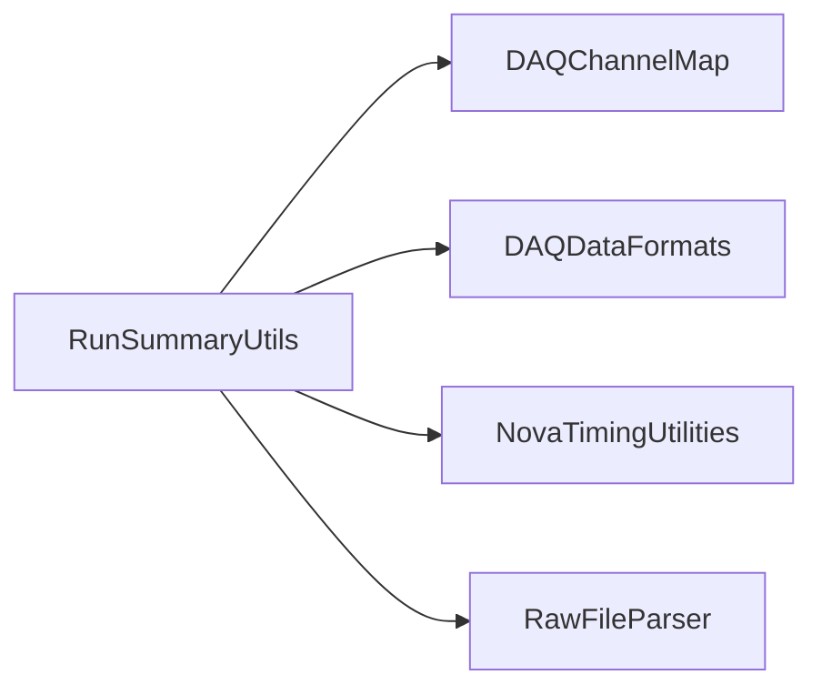

# RunSummaryUtils

Raw-file summary and trigger-count/timing tools plus FEB link-error extraction and ROOT macros.

## Identity and scope

Repository: [NovaDAQ/RunSummaryUtils](https://github.com/NovaDAQ/RunSummaryUtils) · Reviewed commit: `148d674e4d44ccea03f1375fdaec4242f8c390c2` · Domain: **Analysis**.

Tracked files: **26**. Production deployment and owner are **unconfirmed**.

## Operation

Use captured completed runs and reconcile summary totals with raw headers and known events. Check initial/empty-event cases and detector mapping before interpreting histogram or link-error output.

For prerequisites, safe start/stop sequencing, health checks, and rollback see the [operations guide](../operations/index.md).

## Build and integration

This package uses the SRT/SoftRelTools release context. A standalone `make` in a fresh checkout is not a supported build recipe unless the required context is already configured. See [build and release](../operations/build.md).

| Build definition |
| --- |
| [GNUmakefile](https://github.com/NovaDAQ/RunSummaryUtils/blob/148d674e4d44ccea03f1375fdaec4242f8c390c2/GNUmakefile) |
| [cxx/GNUmakefile](https://github.com/NovaDAQ/RunSummaryUtils/blob/148d674e4d44ccea03f1375fdaec4242f8c390c2/cxx/GNUmakefile) |
| [cxx/src/GNUmakefile](https://github.com/NovaDAQ/RunSummaryUtils/blob/148d674e4d44ccea03f1375fdaec4242f8c390c2/cxx/src/GNUmakefile) |
| [cxx/test/GNUmakefile](https://github.com/NovaDAQ/RunSummaryUtils/blob/148d674e4d44ccea03f1375fdaec4242f8c390c2/cxx/test/GNUmakefile) |
| [cxx/unittest/GNUmakefile](https://github.com/NovaDAQ/RunSummaryUtils/blob/148d674e4d44ccea03f1375fdaec4242f8c390c2/cxx/unittest/GNUmakefile) |
| [java/GNUmakefile](https://github.com/NovaDAQ/RunSummaryUtils/blob/148d674e4d44ccea03f1375fdaec4242f8c390c2/java/GNUmakefile) |
| [java/src/GNUmakefile](https://github.com/NovaDAQ/RunSummaryUtils/blob/148d674e4d44ccea03f1375fdaec4242f8c390c2/java/src/GNUmakefile) |
| [java/test/GNUmakefile](https://github.com/NovaDAQ/RunSummaryUtils/blob/148d674e4d44ccea03f1375fdaec4242f8c390c2/java/test/GNUmakefile) |
| [java/unittest/GNUmakefile](https://github.com/NovaDAQ/RunSummaryUtils/blob/148d674e4d44ccea03f1375fdaec4242f8c390c2/java/unittest/GNUmakefile) |

## Entry points

These are source entry points or operational scripts found statically. Installation names and enabled targets depend on the build/configuration; listing a script does not establish that it is deployed.

| Source |
| --- |
| [cxx/src/FebLinkErrorMapping.cc](https://github.com/NovaDAQ/RunSummaryUtils/blob/148d674e4d44ccea03f1375fdaec4242f8c390c2/cxx/src/FebLinkErrorMapping.cc) |
| [cxx/src/FebLinkErrorParser.cc](https://github.com/NovaDAQ/RunSummaryUtils/blob/148d674e4d44ccea03f1375fdaec4242f8c390c2/cxx/src/FebLinkErrorParser.cc) |
| [cxx/src/GetEvent.cc](https://github.com/NovaDAQ/RunSummaryUtils/blob/148d674e4d44ccea03f1375fdaec4242f8c390c2/cxx/src/GetEvent.cc) |
| [cxx/src/GetRawHitTimes.cc](https://github.com/NovaDAQ/RunSummaryUtils/blob/148d674e4d44ccea03f1375fdaec4242f8c390c2/cxx/src/GetRawHitTimes.cc) |
| [cxx/src/RunSummary.cc](https://github.com/NovaDAQ/RunSummaryUtils/blob/148d674e4d44ccea03f1375fdaec4242f8c390c2/cxx/src/RunSummary.cc) |
| [cxx/src/RunTriggerCount.cc](https://github.com/NovaDAQ/RunSummaryUtils/blob/148d674e4d44ccea03f1375fdaec4242f8c390c2/cxx/src/RunTriggerCount.cc) |
| [cxx/src/RunTriggerTimeDump.cc](https://github.com/NovaDAQ/RunSummaryUtils/blob/148d674e4d44ccea03f1375fdaec4242f8c390c2/cxx/src/RunTriggerTimeDump.cc) |

## Interfaces

Headers and declared types form the API navigation map. Follow the source for method signatures, ownership, units, and error contracts. Generated DDS/XSD types are built from the schemas in the next section.

No public C/C++ header was identified in the scoped inventory. Script and schema interfaces are linked elsewhere on this page.

## Configuration and data contracts

No separate XML/IDL/XSD/FHiCL/INI/YAML/JSON configuration was identified. Inspect command-line parsing and site launchers for this package; defaults may be embedded in source.

## Environment and external dependencies

Environment names below are literal lookups found in source, not a guarantee that every value is mandatory. No environment values or credentials are copied into this documentation.

No literal environment lookup was identified by this scan; shell setup scripts may still provide required values.

Unresolved/non-package include roots (some are system or generated headers; this is not a package-manager lockfile):

| Include root | Evidence |
| --- | --- |
| `sys` | [cxx/src/GetEvent.cc:1](https://github.com/NovaDAQ/RunSummaryUtils/blob/148d674e4d44ccea03f1375fdaec4242f8c390c2/cxx/src/GetEvent.cc#L1) |

## Package dependencies

Arrow direction is **consumer → dependency**. This diagram includes source/build/runtime relationships and excludes test-only, release-membership, and build-tool edges. Conditional branches are not evaluated.

| Dependency | Relationship | Evidence |
| --- | --- | --- |
| [DAQChannelMap](DAQChannelMap.md) | build link | [cxx/src/GNUmakefile:17](https://github.com/NovaDAQ/RunSummaryUtils/blob/148d674e4d44ccea03f1375fdaec4242f8c390c2/cxx/src/GNUmakefile#L17) |
| [DAQChannelMap](DAQChannelMap.md) | source include | [cxx/src/GetRawHitTimes.cc:34](https://github.com/NovaDAQ/RunSummaryUtils/blob/148d674e4d44ccea03f1375fdaec4242f8c390c2/cxx/src/GetRawHitTimes.cc#L34) |
| [DAQDataFormats](DAQDataFormats.md) | build link | [cxx/src/GNUmakefile:17](https://github.com/NovaDAQ/RunSummaryUtils/blob/148d674e4d44ccea03f1375fdaec4242f8c390c2/cxx/src/GNUmakefile#L17) |
| [DAQDataFormats](DAQDataFormats.md) | source include | [cxx/src/GetEvent.cc:21](https://github.com/NovaDAQ/RunSummaryUtils/blob/148d674e4d44ccea03f1375fdaec4242f8c390c2/cxx/src/GetEvent.cc#L21) |
| [NovaTimingUtilities](NovaTimingUtilities.md) | build link | [cxx/src/GNUmakefile:17](https://github.com/NovaDAQ/RunSummaryUtils/blob/148d674e4d44ccea03f1375fdaec4242f8c390c2/cxx/src/GNUmakefile#L17) |
| [NovaTimingUtilities](NovaTimingUtilities.md) | source include | [cxx/src/RunTriggerTimeDump.cc:35](https://github.com/NovaDAQ/RunSummaryUtils/blob/148d674e4d44ccea03f1375fdaec4242f8c390c2/cxx/src/RunTriggerTimeDump.cc#L35) |
| [RawFileParser](RawFileParser.md) | build link | [cxx/src/GNUmakefile:17](https://github.com/NovaDAQ/RunSummaryUtils/blob/148d674e4d44ccea03f1375fdaec4242f8c390c2/cxx/src/GNUmakefile#L17) |
| [RawFileParser](RawFileParser.md) | source include | [cxx/src/GetEvent.cc:38](https://github.com/NovaDAQ/RunSummaryUtils/blob/148d674e4d44ccea03f1375fdaec4242f8c390c2/cxx/src/GetEvent.cc#L38) |
| [SRT_ONLINE](SRT_ONLINE.md) | build tool | [GNUmakefile:10](https://github.com/NovaDAQ/RunSummaryUtils/blob/148d674e4d44ccea03f1375fdaec4242f8c390c2/GNUmakefile#L10) |

Direct consumers: None resolved in this snapshot.

Explore upstream/downstream impact in the [dependency explorer](../architecture/explorer.md).

## Validation and review

Static analysis attempted **16 C/C++ translation units**, **0 shell scripts**, and parsed **0 Python files**. Counts are tool input coverage, not proof of successful compilation or exhaustive review. Source/build/configuration inventories and the operating surface were also assessed.

| Severity | Finding | GitHub |
| --- | --- | --- |
| P2 | [NDAQ-018: Skip the first event-size delta until a previous size exists](../review/issues/NDAQ-018.md) | [Issue](https://github.com/NovaDAQ/RunSummaryUtils/issues/1) |
| P3 | [NDAQ-037: Initialize the DCM identifier before printing it in FEB macros](../review/issues/NDAQ-037.md) | [Issue](https://github.com/NovaDAQ/RunSummaryUtils/issues/2) |
| P3 | [NDAQ-038: Close the input file when FEB macro output creation fails](../review/issues/NDAQ-038.md) | [Issue](https://github.com/NovaDAQ/RunSummaryUtils/issues/3) |

Existing test/example sources (not executed against production):

| Source |
| --- |
| [cxx/test/example.cc](https://github.com/NovaDAQ/RunSummaryUtils/blob/148d674e4d44ccea03f1375fdaec4242f8c390c2/cxx/test/example.cc) |
| [cxx/test/example2.cc](https://github.com/NovaDAQ/RunSummaryUtils/blob/148d674e4d44ccea03f1375fdaec4242f8c390c2/cxx/test/example2.cc) |
| [cxx/test/example3.cc](https://github.com/NovaDAQ/RunSummaryUtils/blob/148d674e4d44ccea03f1375fdaec4242f8c390c2/cxx/test/example3.cc) |
| [cxx/test/example4.cc](https://github.com/NovaDAQ/RunSummaryUtils/blob/148d674e4d44ccea03f1375fdaec4242f8c390c2/cxx/test/example4.cc) |

## Existing documentation

No package README/manual identified in the scoped inventory. Use this page and the source interfaces above.
