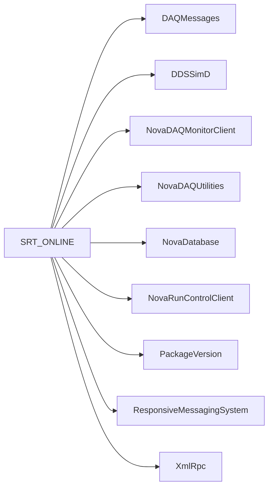

# SRT_ONLINE

SoftRelTools make fragments and release-building scripts used across the online packages.

## Identity and scope

Repository: [NovaDAQ/SRT_ONLINE](https://github.com/NovaDAQ/SRT_ONLINE) · Reviewed commit: `c1d307bb257ebd2537c20637bd5519137bb1b0eb` · Domain: **Build and release**.

Tracked files: **82**. Production deployment and owner are **unconfirmed**.

## Operation

Set the intended SRT public/private contexts and external product versions before building. Most sibling GNUmakefiles depend on these fragments; individual repositories are not necessarily standalone builds.

For prerequisites, safe start/stop sequencing, health checks, and rollback see the [operations guide](../operations/index.md).

## Build and integration

This package uses the SRT/SoftRelTools release context. A standalone `make` in a fresh checkout is not a supported build recipe unless the required context is already configured. See [build and release](../operations/build.md).

| Build definition |
| --- |
| [GNUmakefile](https://github.com/NovaDAQ/SRT_ONLINE/blob/c1d307bb257ebd2537c20637bd5519137bb1b0eb/GNUmakefile) |
| [SoftRelTools/OnlineFlag.mk](https://github.com/NovaDAQ/SRT_ONLINE/blob/c1d307bb257ebd2537c20637bd5519137bb1b0eb/SoftRelTools/OnlineFlag.mk) |
| [SoftRelTools/arch_spec_apr.mk](https://github.com/NovaDAQ/SRT_ONLINE/blob/c1d307bb257ebd2537c20637bd5519137bb1b0eb/SoftRelTools/arch_spec_apr.mk) |
| [SoftRelTools/arch_spec_boost.mk](https://github.com/NovaDAQ/SRT_ONLINE/blob/c1d307bb257ebd2537c20637bd5519137bb1b0eb/SoftRelTools/arch_spec_boost.mk) |
| [SoftRelTools/arch_spec_castor.mk](https://github.com/NovaDAQ/SRT_ONLINE/blob/c1d307bb257ebd2537c20637bd5519137bb1b0eb/SoftRelTools/arch_spec_castor.mk) |
| [SoftRelTools/arch_spec_cppunit.mk](https://github.com/NovaDAQ/SRT_ONLINE/blob/c1d307bb257ebd2537c20637bd5519137bb1b0eb/SoftRelTools/arch_spec_cppunit.mk) |
| [SoftRelTools/arch_spec_cstxsd.mk](https://github.com/NovaDAQ/SRT_ONLINE/blob/c1d307bb257ebd2537c20637bd5519137bb1b0eb/SoftRelTools/arch_spec_cstxsd.mk) |
| [SoftRelTools/arch_spec_curl.mk](https://github.com/NovaDAQ/SRT_ONLINE/blob/c1d307bb257ebd2537c20637bd5519137bb1b0eb/SoftRelTools/arch_spec_curl.mk) |
| [SoftRelTools/arch_spec_doxygen.mk](https://github.com/NovaDAQ/SRT_ONLINE/blob/c1d307bb257ebd2537c20637bd5519137bb1b0eb/SoftRelTools/arch_spec_doxygen.mk) |
| [SoftRelTools/arch_spec_epics.mk](https://github.com/NovaDAQ/SRT_ONLINE/blob/c1d307bb257ebd2537c20637bd5519137bb1b0eb/SoftRelTools/arch_spec_epics.mk) |
| [SoftRelTools/arch_spec_expat.mk](https://github.com/NovaDAQ/SRT_ONLINE/blob/c1d307bb257ebd2537c20637bd5519137bb1b0eb/SoftRelTools/arch_spec_expat.mk) |
| [SoftRelTools/arch_spec_fmwk.mk](https://github.com/NovaDAQ/SRT_ONLINE/blob/c1d307bb257ebd2537c20637bd5519137bb1b0eb/SoftRelTools/arch_spec_fmwk.mk) |
| [SoftRelTools/arch_spec_ganglia.mk](https://github.com/NovaDAQ/SRT_ONLINE/blob/c1d307bb257ebd2537c20637bd5519137bb1b0eb/SoftRelTools/arch_spec_ganglia.mk) |
| [SoftRelTools/arch_spec_icu4c.mk](https://github.com/NovaDAQ/SRT_ONLINE/blob/c1d307bb257ebd2537c20637bd5519137bb1b0eb/SoftRelTools/arch_spec_icu4c.mk) |
| [SoftRelTools/arch_spec_java.mk](https://github.com/NovaDAQ/SRT_ONLINE/blob/c1d307bb257ebd2537c20637bd5519137bb1b0eb/SoftRelTools/arch_spec_java.mk) |
| [SoftRelTools/arch_spec_mf_shared.mk](https://github.com/NovaDAQ/SRT_ONLINE/blob/c1d307bb257ebd2537c20637bd5519137bb1b0eb/SoftRelTools/arch_spec_mf_shared.mk) |
| [SoftRelTools/arch_spec_mf_static.mk](https://github.com/NovaDAQ/SRT_ONLINE/blob/c1d307bb257ebd2537c20637bd5519137bb1b0eb/SoftRelTools/arch_spec_mf_static.mk) |
| [SoftRelTools/arch_spec_mfextensions.mk](https://github.com/NovaDAQ/SRT_ONLINE/blob/c1d307bb257ebd2537c20637bd5519137bb1b0eb/SoftRelTools/arch_spec_mfextensions.mk) |
| [SoftRelTools/arch_spec_ndmc.mk](https://github.com/NovaDAQ/SRT_ONLINE/blob/c1d307bb257ebd2537c20637bd5519137bb1b0eb/SoftRelTools/arch_spec_ndmc.mk) |
| [SoftRelTools/arch_spec_nova.mk](https://github.com/NovaDAQ/SRT_ONLINE/blob/c1d307bb257ebd2537c20637bd5519137bb1b0eb/SoftRelTools/arch_spec_nova.mk) |
| [SoftRelTools/arch_spec_novadb.mk](https://github.com/NovaDAQ/SRT_ONLINE/blob/c1d307bb257ebd2537c20637bd5519137bb1b0eb/SoftRelTools/arch_spec_novadb.mk) |
| [SoftRelTools/arch_spec_onl_root.mk](https://github.com/NovaDAQ/SRT_ONLINE/blob/c1d307bb257ebd2537c20637bd5519137bb1b0eb/SoftRelTools/arch_spec_onl_root.mk) |
| [SoftRelTools/arch_spec_osdds.mk](https://github.com/NovaDAQ/SRT_ONLINE/blob/c1d307bb257ebd2537c20637bd5519137bb1b0eb/SoftRelTools/arch_spec_osdds.mk) |
| [SoftRelTools/arch_spec_osddssimd.mk](https://github.com/NovaDAQ/SRT_ONLINE/blob/c1d307bb257ebd2537c20637bd5519137bb1b0eb/SoftRelTools/arch_spec_osddssimd.mk) |
| [SoftRelTools/arch_spec_pcap.mk](https://github.com/NovaDAQ/SRT_ONLINE/blob/c1d307bb257ebd2537c20637bd5519137bb1b0eb/SoftRelTools/arch_spec_pcap.mk) |
| [SoftRelTools/arch_spec_pgsql.mk](https://github.com/NovaDAQ/SRT_ONLINE/blob/c1d307bb257ebd2537c20637bd5519137bb1b0eb/SoftRelTools/arch_spec_pgsql.mk) |
| [SoftRelTools/arch_spec_qt.mk](https://github.com/NovaDAQ/SRT_ONLINE/blob/c1d307bb257ebd2537c20637bd5519137bb1b0eb/SoftRelTools/arch_spec_qt.mk) |
| [SoftRelTools/arch_spec_qwt.mk](https://github.com/NovaDAQ/SRT_ONLINE/blob/c1d307bb257ebd2537c20637bd5519137bb1b0eb/SoftRelTools/arch_spec_qwt.mk) |
| [SoftRelTools/arch_spec_rcclient.mk](https://github.com/NovaDAQ/SRT_ONLINE/blob/c1d307bb257ebd2537c20637bd5519137bb1b0eb/SoftRelTools/arch_spec_rcclient.mk) |
| [SoftRelTools/arch_spec_rms.mk](https://github.com/NovaDAQ/SRT_ONLINE/blob/c1d307bb257ebd2537c20637bd5519137bb1b0eb/SoftRelTools/arch_spec_rms.mk) |
| [SoftRelTools/arch_spec_root.mk](https://github.com/NovaDAQ/SRT_ONLINE/blob/c1d307bb257ebd2537c20637bd5519137bb1b0eb/SoftRelTools/arch_spec_root.mk) |
| [SoftRelTools/arch_spec_rrdtool.mk](https://github.com/NovaDAQ/SRT_ONLINE/blob/c1d307bb257ebd2537c20637bd5519137bb1b0eb/SoftRelTools/arch_spec_rrdtool.mk) |
| [SoftRelTools/arch_spec_smc.mk](https://github.com/NovaDAQ/SRT_ONLINE/blob/c1d307bb257ebd2537c20637bd5519137bb1b0eb/SoftRelTools/arch_spec_smc.mk) |
| [SoftRelTools/arch_spec_sqlite.mk](https://github.com/NovaDAQ/SRT_ONLINE/blob/c1d307bb257ebd2537c20637bd5519137bb1b0eb/SoftRelTools/arch_spec_sqlite.mk) |
| [SoftRelTools/arch_spec_ups.mk](https://github.com/NovaDAQ/SRT_ONLINE/blob/c1d307bb257ebd2537c20637bd5519137bb1b0eb/SoftRelTools/arch_spec_ups.mk) |
| [SoftRelTools/arch_spec_wxwidget.mk](https://github.com/NovaDAQ/SRT_ONLINE/blob/c1d307bb257ebd2537c20637bd5519137bb1b0eb/SoftRelTools/arch_spec_wxwidget.mk) |
| [SoftRelTools/arch_spec_xercesc.mk](https://github.com/NovaDAQ/SRT_ONLINE/blob/c1d307bb257ebd2537c20637bd5519137bb1b0eb/SoftRelTools/arch_spec_xercesc.mk) |
| [SoftRelTools/arch_spec_xercesc_novadaq.mk](https://github.com/NovaDAQ/SRT_ONLINE/blob/c1d307bb257ebd2537c20637bd5519137bb1b0eb/SoftRelTools/arch_spec_xercesc_novadaq.mk) |
| [SoftRelTools/arch_spec_xmlrpcpp.mk](https://github.com/NovaDAQ/SRT_ONLINE/blob/c1d307bb257ebd2537c20637bd5519137bb1b0eb/SoftRelTools/arch_spec_xmlrpcpp.mk) |
| [SoftRelTools/arch_spec_zmq.mk](https://github.com/NovaDAQ/SRT_ONLINE/blob/c1d307bb257ebd2537c20637bd5519137bb1b0eb/SoftRelTools/arch_spec_zmq.mk) |
| [SoftRelTools/castor.mk](https://github.com/NovaDAQ/SRT_ONLINE/blob/c1d307bb257ebd2537c20637bd5519137bb1b0eb/SoftRelTools/castor.mk) |
| [SoftRelTools/cppunit.mk](https://github.com/NovaDAQ/SRT_ONLINE/blob/c1d307bb257ebd2537c20637bd5519137bb1b0eb/SoftRelTools/cppunit.mk) |
| [SoftRelTools/cstxsd.mk](https://github.com/NovaDAQ/SRT_ONLINE/blob/c1d307bb257ebd2537c20637bd5519137bb1b0eb/SoftRelTools/cstxsd.mk) |
| [SoftRelTools/ddsidl.mk](https://github.com/NovaDAQ/SRT_ONLINE/blob/c1d307bb257ebd2537c20637bd5519137bb1b0eb/SoftRelTools/ddsidl.mk) |
| [SoftRelTools/doxygen.mk](https://github.com/NovaDAQ/SRT_ONLINE/blob/c1d307bb257ebd2537c20637bd5519137bb1b0eb/SoftRelTools/doxygen.mk) |
| [SoftRelTools/java.mk](https://github.com/NovaDAQ/SRT_ONLINE/blob/c1d307bb257ebd2537c20637bd5519137bb1b0eb/SoftRelTools/java.mk) |
| [SoftRelTools/junit.mk](https://github.com/NovaDAQ/SRT_ONLINE/blob/c1d307bb257ebd2537c20637bd5519137bb1b0eb/SoftRelTools/junit.mk) |
| [SoftRelTools/qt.mk](https://github.com/NovaDAQ/SRT_ONLINE/blob/c1d307bb257ebd2537c20637bd5519137bb1b0eb/SoftRelTools/qt.mk) |
| [SoftRelTools/smc.mk](https://github.com/NovaDAQ/SRT_ONLINE/blob/c1d307bb257ebd2537c20637bd5519137bb1b0eb/SoftRelTools/smc.mk) |
| [SoftRelTools/ups.mk](https://github.com/NovaDAQ/SRT_ONLINE/blob/c1d307bb257ebd2537c20637bd5519137bb1b0eb/SoftRelTools/ups.mk) |
| [scripts/GNUmakefile](https://github.com/NovaDAQ/SRT_ONLINE/blob/c1d307bb257ebd2537c20637bd5519137bb1b0eb/scripts/GNUmakefile) |
| [special/arch_spec_boost.mk](https://github.com/NovaDAQ/SRT_ONLINE/blob/c1d307bb257ebd2537c20637bd5519137bb1b0eb/special/arch_spec_boost.mk) |
| [special/compilers/GCC.mk](https://github.com/NovaDAQ/SRT_ONLINE/blob/c1d307bb257ebd2537c20637bd5519137bb1b0eb/special/compilers/GCC.mk) |
| [special/platforms/LinuxPPC.mk](https://github.com/NovaDAQ/SRT_ONLINE/blob/c1d307bb257ebd2537c20637bd5519137bb1b0eb/special/platforms/LinuxPPC.mk) |
| [special/post_standard.mk](https://github.com/NovaDAQ/SRT_ONLINE/blob/c1d307bb257ebd2537c20637bd5519137bb1b0eb/special/post_standard.mk) |

## Entry points

These are source entry points or operational scripts found statically. Installation names and enabled targets depend on the build/configuration; listing a script does not establish that it is deployed.

| Source |
| --- |
| [scripts/make-release.pl](https://github.com/NovaDAQ/SRT_ONLINE/blob/c1d307bb257ebd2537c20637bd5519137bb1b0eb/scripts/make-release.pl) |

## Interfaces

Headers and declared types form the API navigation map. Follow the source for method signatures, ownership, units, and error contracts. Generated DDS/XSD types are built from the schemas in the next section.

No public C/C++ header was identified in the scoped inventory. Script and schema interfaces are linked elsewhere on this page.

## Configuration and data contracts

No separate XML/IDL/XSD/FHiCL/INI/YAML/JSON configuration was identified. Inspect command-line parsing and site launchers for this package; defaults may be embedded in source.

## Environment and external dependencies

Environment names below are literal lookups found in source, not a guarantee that every value is mandatory. No environment values or credentials are copied into this documentation.

No literal environment lookup was identified by this scan; shell setup scripts may still provide required values.

## Package dependencies

Arrow direction is **consumer → dependency**. This diagram includes source/build/runtime relationships and excludes test-only, release-membership, and build-tool edges. Conditional branches are not evaluated.

| Dependency | Relationship | Evidence |
| --- | --- | --- |
| [DAQMessages](DAQMessages.md) | build link | [SoftRelTools/arch_spec_rcclient.mk:13](https://github.com/NovaDAQ/SRT_ONLINE/blob/c1d307bb257ebd2537c20637bd5519137bb1b0eb/SoftRelTools/arch_spec_rcclient.mk#L13) |
| [DDSSimD](DDSSimD.md) | build link | [SoftRelTools/arch_spec_osddssimd.mk:23](https://github.com/NovaDAQ/SRT_ONLINE/blob/c1d307bb257ebd2537c20637bd5519137bb1b0eb/SoftRelTools/arch_spec_osddssimd.mk#L23) |
| [NovaDAQMonitorClient](NovaDAQMonitorClient.md) | build link | [SoftRelTools/arch_spec_ndmc.mk:13](https://github.com/NovaDAQ/SRT_ONLINE/blob/c1d307bb257ebd2537c20637bd5519137bb1b0eb/SoftRelTools/arch_spec_ndmc.mk#L13) |
| [NovaDAQUtilities](NovaDAQUtilities.md) | build link | [SoftRelTools/arch_spec_novadb.mk:13](https://github.com/NovaDAQ/SRT_ONLINE/blob/c1d307bb257ebd2537c20637bd5519137bb1b0eb/SoftRelTools/arch_spec_novadb.mk#L13) |
| [NovaDatabase](NovaDatabase.md) | build link | [SoftRelTools/arch_spec_novadb.mk:13](https://github.com/NovaDAQ/SRT_ONLINE/blob/c1d307bb257ebd2537c20637bd5519137bb1b0eb/SoftRelTools/arch_spec_novadb.mk#L13) |
| [NovaRunControlClient](NovaRunControlClient.md) | build link | [SoftRelTools/arch_spec_rcclient.mk:13](https://github.com/NovaDAQ/SRT_ONLINE/blob/c1d307bb257ebd2537c20637bd5519137bb1b0eb/SoftRelTools/arch_spec_rcclient.mk#L13) |
| [PackageVersion](PackageVersion.md) | build link | [SoftRelTools/arch_spec_nova.mk:36](https://github.com/NovaDAQ/SRT_ONLINE/blob/c1d307bb257ebd2537c20637bd5519137bb1b0eb/SoftRelTools/arch_spec_nova.mk#L36) |
| [ResponsiveMessagingSystem](ResponsiveMessagingSystem.md) | build link | [SoftRelTools/arch_spec_rms.mk:13](https://github.com/NovaDAQ/SRT_ONLINE/blob/c1d307bb257ebd2537c20637bd5519137bb1b0eb/SoftRelTools/arch_spec_rms.mk#L13) |
| [XmlRpc](XmlRpc.md) | build link | [SoftRelTools/arch_spec_xmlrpcpp.mk:12](https://github.com/NovaDAQ/SRT_ONLINE/blob/c1d307bb257ebd2537c20637bd5519137bb1b0eb/SoftRelTools/arch_spec_xmlrpcpp.mk#L12) |

Direct consumers: None resolved in this snapshot.

Explore upstream/downstream impact in the [dependency explorer](../architecture/explorer.md).

## Validation and review

Static analysis attempted **0 C/C++ translation units**, **0 shell scripts**, and parsed **0 Python files**. Counts are tool input coverage, not proof of successful compilation or exhaustive review. Source/build/configuration inventories and the operating surface were also assessed.

No actionable defect was confirmed for this package in this review. This is a bounded review result, not a clean bill of health; unvalidated analyzer diagnostics were not filed as bugs.

Existing test/example sources (not executed against production):

No test/example source identified in the scoped inventory.

## Existing documentation

No package README/manual identified in the scoped inventory. Use this page and the source interfaces above.
