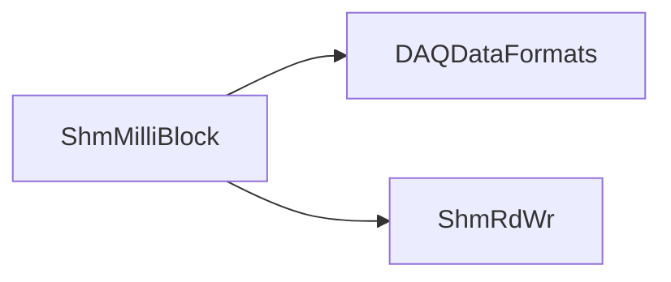

# ShmMilliBlock

Shared-memory wrapper for milliblock publication/consumption.

## Identity and scope

Repository: [NovaDAQ/ShmMilliBlock](https://github.com/NovaDAQ/ShmMilliBlock) · Reviewed commit: `210cbdaa667d7d7b0209b2becc8c5b7ffc4c31d3` · Domain: **Data path**.

Tracked files: **15**. Production deployment and owner are **unconfirmed**.

## Operation

Keep buffer sizes, segment identity, producer format, and reader sequencing aligned. Test wraparound and slow-reader behavior with isolated segments before changing online buffering.

For prerequisites, safe start/stop sequencing, health checks, and rollback see the [operations guide](../operations/index.md).

## Build and integration

This package uses the SRT/SoftRelTools release context. A standalone `make` in a fresh checkout is not a supported build recipe unless the required context is already configured. See [build and release](../operations/build.md).

CMake definitions are present. Most NOvA fragments use parent-provided cetbuildtools macros and dependency targets; consult the files below before treating this directory as a standalone CMake project.

| Build definition |
| --- |
| [CMakeLists.txt](https://github.com/NovaDAQ/ShmMilliBlock/blob/210cbdaa667d7d7b0209b2becc8c5b7ffc4c31d3/CMakeLists.txt) |
| [GNUmakefile](https://github.com/NovaDAQ/ShmMilliBlock/blob/210cbdaa667d7d7b0209b2becc8c5b7ffc4c31d3/GNUmakefile) |
| [cxx/CMakeLists.txt](https://github.com/NovaDAQ/ShmMilliBlock/blob/210cbdaa667d7d7b0209b2becc8c5b7ffc4c31d3/cxx/CMakeLists.txt) |
| [cxx/GNUmakefile](https://github.com/NovaDAQ/ShmMilliBlock/blob/210cbdaa667d7d7b0209b2becc8c5b7ffc4c31d3/cxx/GNUmakefile) |
| [cxx/include/CMakeLists.txt](https://github.com/NovaDAQ/ShmMilliBlock/blob/210cbdaa667d7d7b0209b2becc8c5b7ffc4c31d3/cxx/include/CMakeLists.txt) |
| [cxx/src/CMakeLists.txt](https://github.com/NovaDAQ/ShmMilliBlock/blob/210cbdaa667d7d7b0209b2becc8c5b7ffc4c31d3/cxx/src/CMakeLists.txt) |
| [cxx/src/GNUmakefile](https://github.com/NovaDAQ/ShmMilliBlock/blob/210cbdaa667d7d7b0209b2becc8c5b7ffc4c31d3/cxx/src/GNUmakefile) |
| [cxx/test/GNUmakefile](https://github.com/NovaDAQ/ShmMilliBlock/blob/210cbdaa667d7d7b0209b2becc8c5b7ffc4c31d3/cxx/test/GNUmakefile) |
| [cxx/unittest/GNUmakefile](https://github.com/NovaDAQ/ShmMilliBlock/blob/210cbdaa667d7d7b0209b2becc8c5b7ffc4c31d3/cxx/unittest/GNUmakefile) |

## Entry points

These are source entry points or operational scripts found statically. Installation names and enabled targets depend on the build/configuration; listing a script does not establish that it is deployed.

No standalone executable entry point was identified; this package may provide libraries, contracts, configuration, or binary artifacts.

## Interfaces

Headers and declared types form the API navigation map. Follow the source for method signatures, ownership, units, and error contracts. Generated DDS/XSD types are built from the schemas in the next section.

| Header | Declared types |
| --- | --- |
| [cxx/include/ShmMilliBlock.h](https://github.com/NovaDAQ/ShmMilliBlock/blob/210cbdaa667d7d7b0209b2becc8c5b7ffc4c31d3/cxx/include/ShmMilliBlock.h) | `ShmMilliBlock` |

## Configuration and data contracts

No separate XML/IDL/XSD/FHiCL/INI/YAML/JSON configuration was identified. Inspect command-line parsing and site launchers for this package; defaults may be embedded in source.

## Environment and external dependencies

Environment names below are literal lookups found in source, not a guarantee that every value is mandatory. No environment values or credentials are copied into this documentation.

No literal environment lookup was identified by this scan; shell setup scripts may still provide required values.

Unresolved/non-package include roots (some are system or generated headers; this is not a package-manager lockfile):

| Include root | Evidence |
| --- | --- |
| `..` | [cxx/src/ShmMilliBlock.cpp:9](https://github.com/NovaDAQ/ShmMilliBlock/blob/210cbdaa667d7d7b0209b2becc8c5b7ffc4c31d3/cxx/src/ShmMilliBlock.cpp#L9) |
| `boost` | [cxx/test/Reader.cc:3](https://github.com/NovaDAQ/ShmMilliBlock/blob/210cbdaa667d7d7b0209b2becc8c5b7ffc4c31d3/cxx/test/Reader.cc#L3) |

## Package dependencies

Arrow direction is **consumer → dependency**. This diagram includes source/build/runtime relationships and excludes test-only, release-membership, and build-tool edges. Conditional branches are not evaluated.

| Dependency | Relationship | Evidence |
| --- | --- | --- |
| [DAQDataFormats](DAQDataFormats.md) | build link | [cxx/src/CMakeLists.txt:4](https://github.com/NovaDAQ/ShmMilliBlock/blob/210cbdaa667d7d7b0209b2becc8c5b7ffc4c31d3/cxx/src/CMakeLists.txt#L4) |
| [DAQDataFormats](DAQDataFormats.md) | source include | [cxx/include/ShmMilliBlock.h:12](https://github.com/NovaDAQ/ShmMilliBlock/blob/210cbdaa667d7d7b0209b2becc8c5b7ffc4c31d3/cxx/include/ShmMilliBlock.h#L12) |
| [DAQDataFormats](DAQDataFormats.md) | test include | [cxx/test/ShmMilliBlockTester.cc:13](https://github.com/NovaDAQ/ShmMilliBlock/blob/210cbdaa667d7d7b0209b2becc8c5b7ffc4c31d3/cxx/test/ShmMilliBlockTester.cc#L13) |
| [DAQDataFormats](DAQDataFormats.md) | test link | [cxx/test/GNUmakefile:11](https://github.com/NovaDAQ/ShmMilliBlock/blob/210cbdaa667d7d7b0209b2becc8c5b7ffc4c31d3/cxx/test/GNUmakefile#L11) |
| [SRT_ONLINE](SRT_ONLINE.md) | build tool | [GNUmakefile:10](https://github.com/NovaDAQ/ShmMilliBlock/blob/210cbdaa667d7d7b0209b2becc8c5b7ffc4c31d3/GNUmakefile#L10) |
| [ShmRdWr](ShmRdWr.md) | build link | [cxx/src/CMakeLists.txt:5](https://github.com/NovaDAQ/ShmMilliBlock/blob/210cbdaa667d7d7b0209b2becc8c5b7ffc4c31d3/cxx/src/CMakeLists.txt#L5) |
| [ShmRdWr](ShmRdWr.md) | source include | [cxx/include/ShmMilliBlock.h:13](https://github.com/NovaDAQ/ShmMilliBlock/blob/210cbdaa667d7d7b0209b2becc8c5b7ffc4c31d3/cxx/include/ShmMilliBlock.h#L13) |
| [ShmRdWr](ShmRdWr.md) | test link | [cxx/test/GNUmakefile:11](https://github.com/NovaDAQ/ShmMilliBlock/blob/210cbdaa667d7d7b0209b2becc8c5b7ffc4c31d3/cxx/test/GNUmakefile#L11) |

Direct consumers: [DAQHit.old](DAQHit.old.md).

Explore upstream/downstream impact in the [dependency explorer](../architecture/explorer.md).

## Validation and review

Static analysis attempted **4 C/C++ translation units**, **0 shell scripts**, and parsed **0 Python files**. Counts are tool input coverage, not proof of successful compilation or exhaustive review. Source/build/configuration inventories and the operating surface were also assessed.

No actionable defect was confirmed for this package in this review. This is a bounded review result, not a clean bill of health; unvalidated analyzer diagnostics were not filed as bugs.

Existing test/example sources (not executed against production):

| Source |
| --- |
| [cxx/test/Reader.cc](https://github.com/NovaDAQ/ShmMilliBlock/blob/210cbdaa667d7d7b0209b2becc8c5b7ffc4c31d3/cxx/test/Reader.cc) |
| [cxx/test/ShmMilliBlockTester.cc](https://github.com/NovaDAQ/ShmMilliBlock/blob/210cbdaa667d7d7b0209b2becc8c5b7ffc4c31d3/cxx/test/ShmMilliBlockTester.cc) |
| [cxx/test/TimeChecker.cc](https://github.com/NovaDAQ/ShmMilliBlock/blob/210cbdaa667d7d7b0209b2becc8c5b7ffc4c31d3/cxx/test/TimeChecker.cc) |

## Existing documentation

No package README/manual identified in the scoped inventory. Use this page and the source interfaces above.
