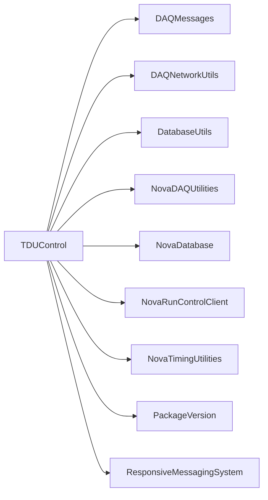

# TDUControl

Qt timing-control server/client, arm/register commands, synchronization, delay, GPS, and error monitoring.

## Identity and scope

Repository: [NovaDAQ/TDUControl](https://github.com/NovaDAQ/TDUControl) · Reviewed commit: `0848df31c58b7b5b74efcdfa6f14ee0dbb0ea568` · Domain: **Timing and triggers**.

Tracked files: **115**. Production deployment and owner are **unconfirmed**.

## Operation

Confirm TDU endpoint, firmware/register map, partition, and timing source. Record synchronization/delay state before changes; verify readback and detector timing before resuming triggers.

For prerequisites, safe start/stop sequencing, health checks, and rollback see the [operations guide](../operations/index.md).

## Build and integration

This package uses the SRT/SoftRelTools release context. A standalone `make` in a fresh checkout is not a supported build recipe unless the required context is already configured. See [build and release](../operations/build.md).

| Build definition |
| --- |
| [GNUmakefile](https://github.com/NovaDAQ/TDUControl/blob/0848df31c58b7b5b74efcdfa6f14ee0dbb0ea568/GNUmakefile) |
| [cxx/GNUmakefile](https://github.com/NovaDAQ/TDUControl/blob/0848df31c58b7b5b74efcdfa6f14ee0dbb0ea568/cxx/GNUmakefile) |
| [cxx/src/GNUmakefile](https://github.com/NovaDAQ/TDUControl/blob/0848df31c58b7b5b74efcdfa6f14ee0dbb0ea568/cxx/src/GNUmakefile) |
| [cxx/src/TDUControlClient.pro](https://github.com/NovaDAQ/TDUControl/blob/0848df31c58b7b5b74efcdfa6f14ee0dbb0ea568/cxx/src/TDUControlClient.pro) |
| [cxx/test/GNUmakefile](https://github.com/NovaDAQ/TDUControl/blob/0848df31c58b7b5b74efcdfa6f14ee0dbb0ea568/cxx/test/GNUmakefile) |
| [cxx/unittest/GNUmakefile](https://github.com/NovaDAQ/TDUControl/blob/0848df31c58b7b5b74efcdfa6f14ee0dbb0ea568/cxx/unittest/GNUmakefile) |
| [java/GNUmakefile](https://github.com/NovaDAQ/TDUControl/blob/0848df31c58b7b5b74efcdfa6f14ee0dbb0ea568/java/GNUmakefile) |
| [java/src/GNUmakefile](https://github.com/NovaDAQ/TDUControl/blob/0848df31c58b7b5b74efcdfa6f14ee0dbb0ea568/java/src/GNUmakefile) |
| [java/test/GNUmakefile](https://github.com/NovaDAQ/TDUControl/blob/0848df31c58b7b5b74efcdfa6f14ee0dbb0ea568/java/test/GNUmakefile) |
| [java/unittest/GNUmakefile](https://github.com/NovaDAQ/TDUControl/blob/0848df31c58b7b5b74efcdfa6f14ee0dbb0ea568/java/unittest/GNUmakefile) |

## Entry points

These are source entry points or operational scripts found statically. Installation names and enabled targets depend on the build/configuration; listing a script does not establish that it is deployed.

| Source |
| --- |
| [cxx/src/TDUControl.cc](https://github.com/NovaDAQ/TDUControl/blob/0848df31c58b7b5b74efcdfa6f14ee0dbb0ea568/cxx/src/TDUControl.cc) |
| [cxx/src/TDUDelayMonitor.cc](https://github.com/NovaDAQ/TDUControl/blob/0848df31c58b7b5b74efcdfa6f14ee0dbb0ea568/cxx/src/TDUDelayMonitor.cc) |
| [cxx/src/TDUGPSMonitor.cc](https://github.com/NovaDAQ/TDUControl/blob/0848df31c58b7b5b74efcdfa6f14ee0dbb0ea568/cxx/src/TDUGPSMonitor.cc) |
| [cxx/src/TDUIdent.cc](https://github.com/NovaDAQ/TDUControl/blob/0848df31c58b7b5b74efcdfa6f14ee0dbb0ea568/cxx/src/TDUIdent.cc) |
| [cxx/src/TDUTestControl.cc](https://github.com/NovaDAQ/TDUControl/blob/0848df31c58b7b5b74efcdfa6f14ee0dbb0ea568/cxx/src/TDUTestControl.cc) |

## Interfaces

Headers and declared types form the API navigation map. Follow the source for method signatures, ownership, units, and error contracts. Generated DDS/XSD types are built from the schemas in the next section.

| Header | Declared types |
| --- | --- |
| [cxx/include/AboutDialog.h](https://github.com/NovaDAQ/TDUControl/blob/0848df31c58b7b5b74efcdfa6f14ee0dbb0ea568/cxx/include/AboutDialog.h) | `AboutDialog` |
| [cxx/include/FiducialLogModel.h](https://github.com/NovaDAQ/TDUControl/blob/0848df31c58b7b5b74efcdfa6f14ee0dbb0ea568/cxx/include/FiducialLogModel.h) | `FiducialLogModel` |
| [cxx/include/RunControlListenThread.h](https://github.com/NovaDAQ/TDUControl/blob/0848df31c58b7b5b74efcdfa6f14ee0dbb0ea568/cxx/include/RunControlListenThread.h) | `RunControlListenThread`, `TDUControlState` |
| [cxx/include/SettingsDialog.h](https://github.com/NovaDAQ/TDUControl/blob/0848df31c58b7b5b74efcdfa6f14ee0dbb0ea568/cxx/include/SettingsDialog.h) | `SettingsDialog` |
| [cxx/include/SyncLogModel.h](https://github.com/NovaDAQ/TDUControl/blob/0848df31c58b7b5b74efcdfa6f14ee0dbb0ea568/cxx/include/SyncLogModel.h) | `SyncLogModel` |
| [cxx/include/TDUArmCommandSet.h](https://github.com/NovaDAQ/TDUControl/blob/0848df31c58b7b5b74efcdfa6f14ee0dbb0ea568/cxx/include/TDUArmCommandSet.h) | `TDUArmCommandSet` |
| [cxx/include/TDUArmControl.h](https://github.com/NovaDAQ/TDUControl/blob/0848df31c58b7b5b74efcdfa6f14ee0dbb0ea568/cxx/include/TDUArmControl.h) | `TDUArmConnection` |
| [cxx/include/TDUArmIdent.h](https://github.com/NovaDAQ/TDUControl/blob/0848df31c58b7b5b74efcdfa6f14ee0dbb0ea568/cxx/include/TDUArmIdent.h) | `OutputFormat`, `TDUArmIdent` |
| [cxx/include/TDUArmMonitor.h](https://github.com/NovaDAQ/TDUControl/blob/0848df31c58b7b5b74efcdfa6f14ee0dbb0ea568/cxx/include/TDUArmMonitor.h) | `OutputFormat`, `TDUArmMonitor` |
| [cxx/include/TDUArmResponseData.h](https://github.com/NovaDAQ/TDUControl/blob/0848df31c58b7b5b74efcdfa6f14ee0dbb0ea568/cxx/include/TDUArmResponseData.h) | `GPSRespMask`, `TDUArmGPSResponse`, `TDUArmIdentResponse`, `TDUArmResponseData`, `TDUArmSocket`, `TDUArmStatusResponse`, `TDUResponse` |
| [cxx/include/TDUArmSocket.h](https://github.com/NovaDAQ/TDUControl/blob/0848df31c58b7b5b74efcdfa6f14ee0dbb0ea568/cxx/include/TDUArmSocket.h) | `TDUArmResponseData`, `TDUArmSocket` |
| [cxx/include/TDUCommandCookie.h](https://github.com/NovaDAQ/TDUControl/blob/0848df31c58b7b5b74efcdfa6f14ee0dbb0ea568/cxx/include/TDUCommandCookie.h) | `CookieID`, `TDUArmCookie`, `TDUCommandCookie` |
| [cxx/include/TDUControlClient.h](https://github.com/NovaDAQ/TDUControl/blob/0848df31c58b7b5b74efcdfa6f14ee0dbb0ea568/cxx/include/TDUControlClient.h) | `InterfaceMode`, `RunControlState`, `TDUControlClient`, `TDUErrorFrame`, `TDUStatusFrame` |
| [cxx/include/TDUDelayMon.h](https://github.com/NovaDAQ/TDUControl/blob/0848df31c58b7b5b74efcdfa6f14ee0dbb0ea568/cxx/include/TDUDelayMon.h) | `TDUDelayMon` |
| [cxx/include/TDUErrorFrame.h](https://github.com/NovaDAQ/TDUControl/blob/0848df31c58b7b5b74efcdfa6f14ee0dbb0ea568/cxx/include/TDUErrorFrame.h) | `TDUErrorFrame` |
| [cxx/include/TDUFirmwareConstants.h](https://github.com/NovaDAQ/TDUControl/blob/0848df31c58b7b5b74efcdfa6f14ee0dbb0ea568/cxx/include/TDUFirmwareConstants.h) | `ControlBits`, `ControlBits2`, `DeviceTargetMasks`, `GPSLock`, `MasterTDUFirmwareVersions`, `StatusBits`, `TDUCommands`, `TDUFirmwareFeatures`, `TDUVersionNumbers`, `TimingCommandAddresses`, `TimingCommandControlBits`, `TimingCommandRegisterMap`, `TimingPartitionAddress` |
| [cxx/include/TDUStatusFrame.h](https://github.com/NovaDAQ/TDUControl/blob/0848df31c58b7b5b74efcdfa6f14ee0dbb0ea568/cxx/include/TDUStatusFrame.h) | `TDUStatusFrame` |
| [cxx/include/qled.h](https://github.com/NovaDAQ/TDUControl/blob/0848df31c58b7b5b74efcdfa6f14ee0dbb0ea568/cxx/include/qled.h) | `QColor`, `QDESIGNER_WIDGET_EXPORT`, `QSvgRenderer`, `QTimer`, `ledColor`, `ledShape` |
| [cxx/include/version.h](https://github.com/NovaDAQ/TDUControl/blob/0848df31c58b7b5b74efcdfa6f14ee0dbb0ea568/cxx/include/version.h) | Functions, constants, or templates |
| [cxx/src/qled.h](https://github.com/NovaDAQ/TDUControl/blob/0848df31c58b7b5b74efcdfa6f14ee0dbb0ea568/cxx/src/qled.h) | `QColor`, `QDESIGNER_WIDGET_EXPORT`, `QSvgRenderer`, `QTimer`, `ledColor`, `ledShape` |

## Configuration and data contracts

No separate XML/IDL/XSD/FHiCL/INI/YAML/JSON configuration was identified. Inspect command-line parsing and site launchers for this package; defaults may be embedded in source.

## Environment and external dependencies

Environment names below are literal lookups found in source, not a guarantee that every value is mandatory. No environment values or credentials are copied into this documentation.

No literal environment lookup was identified by this scan; shell setup scripts may still provide required values.

Unresolved/non-package include roots (some are system or generated headers; this is not a package-manager lockfile):

| Include root | Evidence |
| --- | --- |
| `Qt` | [cxx/src/qled.cpp:20](https://github.com/NovaDAQ/TDUControl/blob/0848df31c58b7b5b74efcdfa6f14ee0dbb0ea568/cxx/src/qled.cpp#L20) |
| `QtCore` | [cxx/include/FiducialLogModel.h:5](https://github.com/NovaDAQ/TDUControl/blob/0848df31c58b7b5b74efcdfa6f14ee0dbb0ea568/cxx/include/FiducialLogModel.h#L5) |
| `QtDesigner` | [cxx/include/qled.h:21](https://github.com/NovaDAQ/TDUControl/blob/0848df31c58b7b5b74efcdfa6f14ee0dbb0ea568/cxx/include/qled.h#L21) |
| `QtGui` | [cxx/include/AboutDialog.h:4](https://github.com/NovaDAQ/TDUControl/blob/0848df31c58b7b5b74efcdfa6f14ee0dbb0ea568/cxx/include/AboutDialog.h#L4) |
| `QtNetwork` | [cxx/include/TDUArmCommandSet.h:5](https://github.com/NovaDAQ/TDUControl/blob/0848df31c58b7b5b74efcdfa6f14ee0dbb0ea568/cxx/include/TDUArmCommandSet.h#L5) |
| `QtSvg` | [cxx/src/qled.cpp:21](https://github.com/NovaDAQ/TDUControl/blob/0848df31c58b7b5b74efcdfa6f14ee0dbb0ea568/cxx/src/qled.cpp#L21) |
| `QtXml` | [cxx/include/TDUControlClient.h:10](https://github.com/NovaDAQ/TDUControl/blob/0848df31c58b7b5b74efcdfa6f14ee0dbb0ea568/cxx/include/TDUControlClient.h#L10) |
| `boost` | [cxx/include/RunControlListenThread.h:8](https://github.com/NovaDAQ/TDUControl/blob/0848df31c58b7b5b74efcdfa6f14ee0dbb0ea568/cxx/include/RunControlListenThread.h#L8) |
| `messagefacility` | [cxx/src/TDUControlClient.cpp:40](https://github.com/NovaDAQ/TDUControl/blob/0848df31c58b7b5b74efcdfa6f14ee0dbb0ea568/cxx/src/TDUControlClient.cpp#L40) |
| `sys` | [cxx/src/TDUControl.cc:7](https://github.com/NovaDAQ/TDUControl/blob/0848df31c58b7b5b74efcdfa6f14ee0dbb0ea568/cxx/src/TDUControl.cc#L7) |

## Package dependencies

Arrow direction is **consumer → dependency**. This diagram includes source/build/runtime relationships and excludes test-only, release-membership, and build-tool edges. Conditional branches are not evaluated.

| Dependency | Relationship | Evidence |
| --- | --- | --- |
| [DAQMessages](DAQMessages.md) | build link | [cxx/src/GNUmakefile:55](https://github.com/NovaDAQ/TDUControl/blob/0848df31c58b7b5b74efcdfa6f14ee0dbb0ea568/cxx/src/GNUmakefile#L55) |
| [DAQMessages](DAQMessages.md) | source include | [cxx/include/RunControlListenThread.h:7](https://github.com/NovaDAQ/TDUControl/blob/0848df31c58b7b5b74efcdfa6f14ee0dbb0ea568/cxx/include/RunControlListenThread.h#L7) |
| [DAQNetworkUtils](DAQNetworkUtils.md) | build link | [cxx/src/GNUmakefile:55](https://github.com/NovaDAQ/TDUControl/blob/0848df31c58b7b5b74efcdfa6f14ee0dbb0ea568/cxx/src/GNUmakefile#L55) |
| [DAQNetworkUtils](DAQNetworkUtils.md) | source include | [cxx/include/TDUArmIdent.h:8](https://github.com/NovaDAQ/TDUControl/blob/0848df31c58b7b5b74efcdfa6f14ee0dbb0ea568/cxx/include/TDUArmIdent.h#L8) |
| [DatabaseUtils](DatabaseUtils.md) | build link | [cxx/src/GNUmakefile:55](https://github.com/NovaDAQ/TDUControl/blob/0848df31c58b7b5b74efcdfa6f14ee0dbb0ea568/cxx/src/GNUmakefile#L55) |
| [DatabaseUtils](DatabaseUtils.md) | source include | [cxx/include/TDUDelayMon.h:14](https://github.com/NovaDAQ/TDUControl/blob/0848df31c58b7b5b74efcdfa6f14ee0dbb0ea568/cxx/include/TDUDelayMon.h#L14) |
| [NovaDAQUtilities](NovaDAQUtilities.md) | build link | [cxx/src/GNUmakefile:55](https://github.com/NovaDAQ/TDUControl/blob/0848df31c58b7b5b74efcdfa6f14ee0dbb0ea568/cxx/src/GNUmakefile#L55) |
| [NovaDAQUtilities](NovaDAQUtilities.md) | source include | [cxx/src/TDUDelayMon.cpp:33](https://github.com/NovaDAQ/TDUControl/blob/0848df31c58b7b5b74efcdfa6f14ee0dbb0ea568/cxx/src/TDUDelayMon.cpp#L33) |
| [NovaDatabase](NovaDatabase.md) | build link | [cxx/src/GNUmakefile:55](https://github.com/NovaDAQ/TDUControl/blob/0848df31c58b7b5b74efcdfa6f14ee0dbb0ea568/cxx/src/GNUmakefile#L55) |
| [NovaDatabase](NovaDatabase.md) | source include | [cxx/src/TDUDelayMon.cpp:34](https://github.com/NovaDAQ/TDUControl/blob/0848df31c58b7b5b74efcdfa6f14ee0dbb0ea568/cxx/src/TDUDelayMon.cpp#L34) |
| [NovaRunControlClient](NovaRunControlClient.md) | build link | [cxx/src/GNUmakefile:55](https://github.com/NovaDAQ/TDUControl/blob/0848df31c58b7b5b74efcdfa6f14ee0dbb0ea568/cxx/src/GNUmakefile#L55) |
| [NovaRunControlClient](NovaRunControlClient.md) | source include | [cxx/include/RunControlListenThread.h:6](https://github.com/NovaDAQ/TDUControl/blob/0848df31c58b7b5b74efcdfa6f14ee0dbb0ea568/cxx/include/RunControlListenThread.h#L6) |
| [NovaTimingUtilities](NovaTimingUtilities.md) | build link | [cxx/src/GNUmakefile:55](https://github.com/NovaDAQ/TDUControl/blob/0848df31c58b7b5b74efcdfa6f14ee0dbb0ea568/cxx/src/GNUmakefile#L55) |
| [NovaTimingUtilities](NovaTimingUtilities.md) | source include | [cxx/src/RunControlListenThread.cpp:12](https://github.com/NovaDAQ/TDUControl/blob/0848df31c58b7b5b74efcdfa6f14ee0dbb0ea568/cxx/src/RunControlListenThread.cpp#L12) |
| [PackageVersion](PackageVersion.md) | build link | [cxx/src/GNUmakefile:55](https://github.com/NovaDAQ/TDUControl/blob/0848df31c58b7b5b74efcdfa6f14ee0dbb0ea568/cxx/src/GNUmakefile#L55) |
| [PackageVersion](PackageVersion.md) | source include | [cxx/include/version.h:28](https://github.com/NovaDAQ/TDUControl/blob/0848df31c58b7b5b74efcdfa6f14ee0dbb0ea568/cxx/include/version.h#L28) |
| [ResponsiveMessagingSystem](ResponsiveMessagingSystem.md) | source include | [cxx/src/RunControlListenThread.cpp:8](https://github.com/NovaDAQ/TDUControl/blob/0848df31c58b7b5b74efcdfa6f14ee0dbb0ea568/cxx/src/RunControlListenThread.cpp#L8) |
| [SRT_ONLINE](SRT_ONLINE.md) | build tool | [GNUmakefile:10](https://github.com/NovaDAQ/TDUControl/blob/0848df31c58b7b5b74efcdfa6f14ee0dbb0ea568/GNUmakefile#L10) |

Direct consumers: [TDUUtilities](TDUUtilities.md).

Explore upstream/downstream impact in the [dependency explorer](../architecture/explorer.md).

## Validation and review

Static analysis attempted **19 C/C++ translation units**, **0 shell scripts**, and parsed **0 Python files**. Counts are tool input coverage, not proof of successful compilation or exhaustive review. Source/build/configuration inventories and the operating surface were also assessed.

No actionable defect was confirmed for this package in this review. This is a bounded review result, not a clean bill of health; unvalidated analyzer diagnostics were not filed as bugs.

Existing test/example sources (not executed against production):

No test/example source identified in the scoped inventory.

## Existing documentation

No package README/manual identified in the scoped inventory. Use this page and the source interfaces above.
