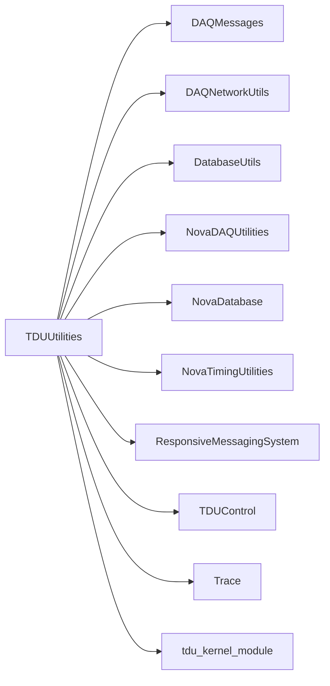

# TDUUtilities

TDU register/diagnostic commands and loading/validation of timing-delay constants.

## Identity and scope

Repository: [NovaDAQ/TDUUtilities](https://github.com/NovaDAQ/TDUUtilities) · Reviewed commit: `6538bc8361c413f191eb31521e3f08aeb00b7d75` · Domain: **Timing and triggers**.

Tracked files: **31**. Production deployment and owner are **unconfirmed**.

## Operation

Use the correct hardware interface and calibration database/file. Validate constants and record previous values before loading. Destructive register diagnostics require a dedicated test TDU.

For prerequisites, safe start/stop sequencing, health checks, and rollback see the [operations guide](../operations/index.md).

## Build and integration

This package uses the SRT/SoftRelTools release context. A standalone `make` in a fresh checkout is not a supported build recipe unless the required context is already configured. See [build and release](../operations/build.md).

| Build definition |
| --- |
| [GNUmakefile](https://github.com/NovaDAQ/TDUUtilities/blob/6538bc8361c413f191eb31521e3f08aeb00b7d75/GNUmakefile) |
| [cxx/GNUmakefile](https://github.com/NovaDAQ/TDUUtilities/blob/6538bc8361c413f191eb31521e3f08aeb00b7d75/cxx/GNUmakefile) |
| [cxx/src/GNUmakefile](https://github.com/NovaDAQ/TDUUtilities/blob/6538bc8361c413f191eb31521e3f08aeb00b7d75/cxx/src/GNUmakefile) |
| [script/GNUmakefile](https://github.com/NovaDAQ/TDUUtilities/blob/6538bc8361c413f191eb31521e3f08aeb00b7d75/script/GNUmakefile) |

## Entry points

These are source entry points or operational scripts found statically. Installation names and enabled targets depend on the build/configuration; listing a script does not establish that it is deployed.

| Source |
| --- |
| [cxx/src/LoadDCMTimingDelayConstants.cc](https://github.com/NovaDAQ/TDUUtilities/blob/6538bc8361c413f191eb31521e3f08aeb00b7d75/cxx/src/LoadDCMTimingDelayConstants.cc) |
| [cxx/src/LoadTDUDelaysFromDatabase.cc](https://github.com/NovaDAQ/TDUUtilities/blob/6538bc8361c413f191eb31521e3f08aeb00b7d75/cxx/src/LoadTDUDelaysFromDatabase.cc) |
| [cxx/src/LoadTDUTimingDelayConstants.cc](https://github.com/NovaDAQ/TDUUtilities/blob/6538bc8361c413f191eb31521e3f08aeb00b7d75/cxx/src/LoadTDUTimingDelayConstants.cc) |
| [cxx/src/ValidateTimingDelayConstants.cc](https://github.com/NovaDAQ/TDUUtilities/blob/6538bc8361c413f191eb31521e3f08aeb00b7d75/cxx/src/ValidateTimingDelayConstants.cc) |
| [cxx/src/tduClearErrors.cc](https://github.com/NovaDAQ/TDUUtilities/blob/6538bc8361c413f191eb31521e3f08aeb00b7d75/cxx/src/tduClearErrors.cc) |
| [cxx/src/tduControl.cc](https://github.com/NovaDAQ/TDUUtilities/blob/6538bc8361c413f191eb31521e3f08aeb00b7d75/cxx/src/tduControl.cc) |
| [cxx/src/tduDelayLearn.cc](https://github.com/NovaDAQ/TDUUtilities/blob/6538bc8361c413f191eb31521e3f08aeb00b7d75/cxx/src/tduDelayLearn.cc) |
| [cxx/src/tduErrorMonitor.cc](https://github.com/NovaDAQ/TDUUtilities/blob/6538bc8361c413f191eb31521e3f08aeb00b7d75/cxx/src/tduErrorMonitor.cc) |
| [cxx/src/tduGblTimingSysRegWrite.cc](https://github.com/NovaDAQ/TDUUtilities/blob/6538bc8361c413f191eb31521e3f08aeb00b7d75/cxx/src/tduGblTimingSysRegWrite.cc) |
| [cxx/src/tduPreset.cc](https://github.com/NovaDAQ/TDUUtilities/blob/6538bc8361c413f191eb31521e3f08aeb00b7d75/cxx/src/tduPreset.cc) |
| [cxx/src/tduRegDump.cc](https://github.com/NovaDAQ/TDUUtilities/blob/6538bc8361c413f191eb31521e3f08aeb00b7d75/cxx/src/tduRegDump.cc) |
| [cxx/src/tduRegisterDiagnostics.cc](https://github.com/NovaDAQ/TDUUtilities/blob/6538bc8361c413f191eb31521e3f08aeb00b7d75/cxx/src/tduRegisterDiagnostics.cc) |
| [cxx/src/tduSync.cc](https://github.com/NovaDAQ/TDUUtilities/blob/6538bc8361c413f191eb31521e3f08aeb00b7d75/cxx/src/tduSync.cc) |
| [cxx/src/tduTCLKEnableDisable.cc](https://github.com/NovaDAQ/TDUUtilities/blob/6538bc8361c413f191eb31521e3f08aeb00b7d75/cxx/src/tduTCLKEnableDisable.cc) |
| [cxx/src/tduWriteDelay.cc](https://github.com/NovaDAQ/TDUUtilities/blob/6538bc8361c413f191eb31521e3f08aeb00b7d75/cxx/src/tduWriteDelay.cc) |
| [script/basic_timemarkers.sh](https://github.com/NovaDAQ/TDUUtilities/blob/6538bc8361c413f191eb31521e3f08aeb00b7d75/script/basic_timemarkers.sh) |
| [script/dcmapp_external_timing.sh](https://github.com/NovaDAQ/TDUUtilities/blob/6538bc8361c413f191eb31521e3f08aeb00b7d75/script/dcmapp_external_timing.sh) |
| [script/external_pulse_at_febs.sh](https://github.com/NovaDAQ/TDUUtilities/blob/6538bc8361c413f191eb31521e3f08aeb00b7d75/script/external_pulse_at_febs.sh) |
| [script/tdu_load_delay_from_database.sh](https://github.com/NovaDAQ/TDUUtilities/blob/6538bc8361c413f191eb31521e3f08aeb00b7d75/script/tdu_load_delay_from_database.sh) |
| [script/tdu_tlink_cmd_test.sh](https://github.com/NovaDAQ/TDUUtilities/blob/6538bc8361c413f191eb31521e3f08aeb00b7d75/script/tdu_tlink_cmd_test.sh) |
| [script/timing_chain_delay_calibration.sh](https://github.com/NovaDAQ/TDUUtilities/blob/6538bc8361c413f191eb31521e3f08aeb00b7d75/script/timing_chain_delay_calibration.sh) |
| [script/timing_chain_delay_learn.sh](https://github.com/NovaDAQ/TDUUtilities/blob/6538bc8361c413f191eb31521e3f08aeb00b7d75/script/timing_chain_delay_learn.sh) |
| [script/timing_chain_delay_validation.sh](https://github.com/NovaDAQ/TDUUtilities/blob/6538bc8361c413f191eb31521e3f08aeb00b7d75/script/timing_chain_delay_validation.sh) |

## Interfaces

Headers and declared types form the API navigation map. Follow the source for method signatures, ownership, units, and error contracts. Generated DDS/XSD types are built from the schemas in the next section.

| Header | Declared types |
| --- | --- |
| [cxx/include/tdu.h](https://github.com/NovaDAQ/TDUUtilities/blob/6538bc8361c413f191eb31521e3f08aeb00b7d75/cxx/include/tdu.h) | `tdu` |

## Configuration and data contracts

No separate XML/IDL/XSD/FHiCL/INI/YAML/JSON configuration was identified. Inspect command-line parsing and site launchers for this package; defaults may be embedded in source.

## Environment and external dependencies

Environment names below are literal lookups found in source, not a guarantee that every value is mandatory. No environment values or credentials are copied into this documentation.

No literal environment lookup was identified by this scan; shell setup scripts may still provide required values.

Unresolved/non-package include roots (some are system or generated headers; this is not a package-manager lockfile):

| Include root | Evidence |
| --- | --- |
| `QtCore` | [cxx/src/tduClearErrors.cc:16](https://github.com/NovaDAQ/TDUUtilities/blob/6538bc8361c413f191eb31521e3f08aeb00b7d75/cxx/src/tduClearErrors.cc#L16) |
| `QtNetwork` | [cxx/src/tduClearErrors.cc:17](https://github.com/NovaDAQ/TDUUtilities/blob/6538bc8361c413f191eb31521e3f08aeb00b7d75/cxx/src/tduClearErrors.cc#L17) |
| `boost` | [cxx/src/LoadDCMTimingDelayConstants.cc:6](https://github.com/NovaDAQ/TDUUtilities/blob/6538bc8361c413f191eb31521e3f08aeb00b7d75/cxx/src/LoadDCMTimingDelayConstants.cc#L6) |
| `sys` | [cxx/src/tdu.cpp:4](https://github.com/NovaDAQ/TDUUtilities/blob/6538bc8361c413f191eb31521e3f08aeb00b7d75/cxx/src/tdu.cpp#L4) |

## Package dependencies

Arrow direction is **consumer → dependency**. This diagram includes source/build/runtime relationships and excludes test-only, release-membership, and build-tool edges. Conditional branches are not evaluated.

| Dependency | Relationship | Evidence |
| --- | --- | --- |
| [DAQMessages](DAQMessages.md) | source include | [cxx/src/LoadDCMTimingDelayConstants.cc:1](https://github.com/NovaDAQ/TDUUtilities/blob/6538bc8361c413f191eb31521e3f08aeb00b7d75/cxx/src/LoadDCMTimingDelayConstants.cc#L1) |
| [DAQNetworkUtils](DAQNetworkUtils.md) | source include | [cxx/src/tduClearErrors.cc:23](https://github.com/NovaDAQ/TDUUtilities/blob/6538bc8361c413f191eb31521e3f08aeb00b7d75/cxx/src/tduClearErrors.cc#L23) |
| [DatabaseUtils](DatabaseUtils.md) | build link | [cxx/src/GNUmakefile:23](https://github.com/NovaDAQ/TDUUtilities/blob/6538bc8361c413f191eb31521e3f08aeb00b7d75/cxx/src/GNUmakefile#L23) |
| [DatabaseUtils](DatabaseUtils.md) | source include | [cxx/src/LoadDCMTimingDelayConstants.cc:2](https://github.com/NovaDAQ/TDUUtilities/blob/6538bc8361c413f191eb31521e3f08aeb00b7d75/cxx/src/LoadDCMTimingDelayConstants.cc#L2) |
| [NovaDAQUtilities](NovaDAQUtilities.md) | source include | [cxx/src/LoadDCMTimingDelayConstants.cc:3](https://github.com/NovaDAQ/TDUUtilities/blob/6538bc8361c413f191eb31521e3f08aeb00b7d75/cxx/src/LoadDCMTimingDelayConstants.cc#L3) |
| [NovaDatabase](NovaDatabase.md) | source include | [cxx/src/LoadDCMTimingDelayConstants.cc:4](https://github.com/NovaDAQ/TDUUtilities/blob/6538bc8361c413f191eb31521e3f08aeb00b7d75/cxx/src/LoadDCMTimingDelayConstants.cc#L4) |
| [NovaTimingUtilities](NovaTimingUtilities.md) | build link | [cxx/src/GNUmakefile:20](https://github.com/NovaDAQ/TDUUtilities/blob/6538bc8361c413f191eb31521e3f08aeb00b7d75/cxx/src/GNUmakefile#L20) |
| [NovaTimingUtilities](NovaTimingUtilities.md) | source include | [cxx/src/tduErrorMonitor.cc:13](https://github.com/NovaDAQ/TDUUtilities/blob/6538bc8361c413f191eb31521e3f08aeb00b7d75/cxx/src/tduErrorMonitor.cc#L13) |
| [ResponsiveMessagingSystem](ResponsiveMessagingSystem.md) | source include | [cxx/src/LoadDCMTimingDelayConstants.cc:5](https://github.com/NovaDAQ/TDUUtilities/blob/6538bc8361c413f191eb31521e3f08aeb00b7d75/cxx/src/LoadDCMTimingDelayConstants.cc#L5) |
| [SRT_ONLINE](SRT_ONLINE.md) | build tool | [GNUmakefile:10](https://github.com/NovaDAQ/TDUUtilities/blob/6538bc8361c413f191eb31521e3f08aeb00b7d75/GNUmakefile#L10) |
| [TDUControl](TDUControl.md) | build link | [cxx/src/GNUmakefile:23](https://github.com/NovaDAQ/TDUUtilities/blob/6538bc8361c413f191eb31521e3f08aeb00b7d75/cxx/src/GNUmakefile#L23) |
| [TDUControl](TDUControl.md) | source include | [cxx/src/tduClearErrors.cc:21](https://github.com/NovaDAQ/TDUUtilities/blob/6538bc8361c413f191eb31521e3f08aeb00b7d75/cxx/src/tduClearErrors.cc#L21) |
| [Trace](Trace.md) | build link | [cxx/src/GNUmakefile:20](https://github.com/NovaDAQ/TDUUtilities/blob/6538bc8361c413f191eb31521e3f08aeb00b7d75/cxx/src/GNUmakefile#L20) |
| [tdu_kernel_module](tdu_kernel_module.md) | source include | [cxx/include/tdu.h:6](https://github.com/NovaDAQ/TDUUtilities/blob/6538bc8361c413f191eb31521e3f08aeb00b7d75/cxx/include/tdu.h#L6) |

Direct consumers: [NovaSpillServer](NovaSpillServer.md), [TDUWeb](TDUWeb.md).

Explore upstream/downstream impact in the [dependency explorer](../architecture/explorer.md).

## Validation and review

Static analysis attempted **16 C/C++ translation units**, **8 shell scripts**, and parsed **0 Python files**. Counts are tool input coverage, not proof of successful compilation or exhaustive review. Source/build/configuration inventories and the operating surface were also assessed.

No actionable defect was confirmed for this package in this review. This is a bounded review result, not a clean bill of health; unvalidated analyzer diagnostics were not filed as bugs.

Existing test/example sources (not executed against production):

No test/example source identified in the scoped inventory.

## Existing documentation

No package README/manual identified in the scoped inventory. Use this page and the source interfaces above.
