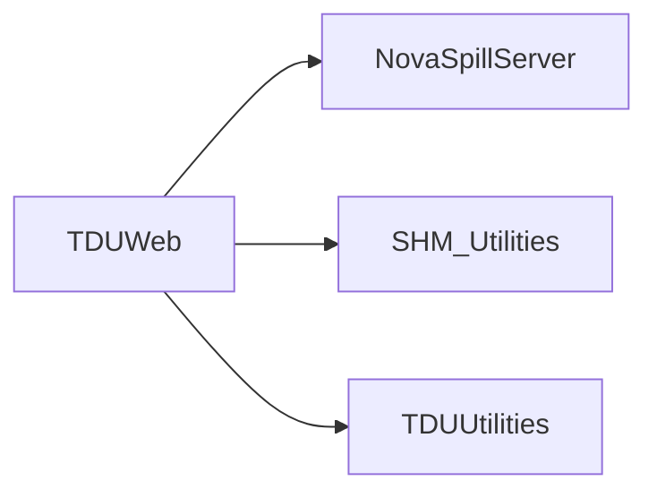

# TDUWeb

Bottle HTTP wrapper around TDU status, timing-control, spill-history, and TCR commands.

## Identity and scope

Repository: [NovaDAQ/TDUWeb](https://github.com/NovaDAQ/TDUWeb) · Reviewed commit: `e9904eba0d5ef9da4adac18c3f6374523bc008f2` · Domain: **Timing and triggers**.

Tracked files: **13**. Production deployment and owner are **unconfirmed**.

## Operation

The source binds port 8080 on all interfaces. Status endpoints invoke local tools; mutation endpoints change hardware. Review the authentication finding before exposing this service to clients.

For prerequisites, safe start/stop sequencing, health checks, and rollback see the [operations guide](../operations/index.md).

## Build and integration

No supported make/CMake build definition was found in the scoped inventory. Use the source-linked entry points and existing package instructions; do not infer a missing build command.

## Entry points

These are source entry points or operational scripts found statically. Installation names and enabled targets depend on the build/configuration; listing a script does not establish that it is deployed.

| Source |
| --- |
| [server/bottle.py](https://github.com/NovaDAQ/TDUWeb/blob/e9904eba0d5ef9da4adac18c3f6374523bc008f2/server/bottle.py) |

## Interfaces

Headers and declared types form the API navigation map. Follow the source for method signatures, ownership, units, and error contracts. Generated DDS/XSD types are built from the schemas in the next section.

No public C/C++ header was identified in the scoped inventory. Script and schema interfaces are linked elsewhere on this page.

## Configuration and data contracts

No separate XML/IDL/XSD/FHiCL/INI/YAML/JSON configuration was identified. Inspect command-line parsing and site launchers for this package; defaults may be embedded in source.

## Environment and external dependencies

Environment names below are literal lookups found in source, not a guarantee that every value is mandatory. No environment values or credentials are copied into this documentation.

| Variable | Evidence |
| --- | --- |
| `BOTTLE_CHILD` | [server/bottle.py:3178](https://github.com/NovaDAQ/TDUWeb/blob/e9904eba0d5ef9da4adac18c3f6374523bc008f2/server/bottle.py#L3178) |
| `BOTTLE_LOCKFILE` | [server/bottle.py:3188](https://github.com/NovaDAQ/TDUWeb/blob/e9904eba0d5ef9da4adac18c3f6374523bc008f2/server/bottle.py#L3188) |
| `CONTENT_LENGTH` | [server/bottle.py:1354](https://github.com/NovaDAQ/TDUWeb/blob/e9904eba0d5ef9da4adac18c3f6374523bc008f2/server/bottle.py#L1354) |
| `CONTENT_TYPE` | [server/bottle.py:1160](https://github.com/NovaDAQ/TDUWeb/blob/e9904eba0d5ef9da4adac18c3f6374523bc008f2/server/bottle.py#L1160) |
| `HTTP_AUTHORIZATION` | [server/bottle.py:1382](https://github.com/NovaDAQ/TDUWeb/blob/e9904eba0d5ef9da4adac18c3f6374523bc008f2/server/bottle.py#L1382) |
| `HTTP_COOKIE` | [server/bottle.py:1093](https://github.com/NovaDAQ/TDUWeb/blob/e9904eba0d5ef9da4adac18c3f6374523bc008f2/server/bottle.py#L1093) |
| `HTTP_IF_MODIFIED_SINCE` | [server/bottle.py:2514](https://github.com/NovaDAQ/TDUWeb/blob/e9904eba0d5ef9da4adac18c3f6374523bc008f2/server/bottle.py#L2514) |
| `HTTP_RANGE` | [server/bottle.py:2525](https://github.com/NovaDAQ/TDUWeb/blob/e9904eba0d5ef9da4adac18c3f6374523bc008f2/server/bottle.py#L2525) |
| `HTTP_X_FORWARDED_FOR` | [server/bottle.py:1394](https://github.com/NovaDAQ/TDUWeb/blob/e9904eba0d5ef9da4adac18c3f6374523bc008f2/server/bottle.py#L1394) |
| `HTTP_X_REQUESTED_WITH` | [server/bottle.py:1366](https://github.com/NovaDAQ/TDUWeb/blob/e9904eba0d5ef9da4adac18c3f6374523bc008f2/server/bottle.py#L1366) |
| `PATH_INFO` | [server/bottle.py:451](https://github.com/NovaDAQ/TDUWeb/blob/e9904eba0d5ef9da4adac18c3f6374523bc008f2/server/bottle.py#L451) |
| `QUERY_STRING` | [server/bottle.py:1114](https://github.com/NovaDAQ/TDUWeb/blob/e9904eba0d5ef9da4adac18c3f6374523bc008f2/server/bottle.py#L1114) |
| `REMOTE_ADDR` | [server/bottle.py:1396](https://github.com/NovaDAQ/TDUWeb/blob/e9904eba0d5ef9da4adac18c3f6374523bc008f2/server/bottle.py#L1396) |
| `REMOTE_USER` | [server/bottle.py:1384](https://github.com/NovaDAQ/TDUWeb/blob/e9904eba0d5ef9da4adac18c3f6374523bc008f2/server/bottle.py#L1384) |
| `REQUEST_METHOD` | [server/bottle.py:450](https://github.com/NovaDAQ/TDUWeb/blob/e9904eba0d5ef9da4adac18c3f6374523bc008f2/server/bottle.py#L450) |
| `SCRIPT_NAME` | [server/bottle.py:789](https://github.com/NovaDAQ/TDUWeb/blob/e9904eba0d5ef9da4adac18c3f6374523bc008f2/server/bottle.py#L789) |

## Package dependencies

Arrow direction is **consumer → dependency**. This diagram includes source/build/runtime relationships and excludes test-only, release-membership, and build-tool edges. Conditional branches are not evaluated.

| Dependency | Relationship | Evidence |
| --- | --- | --- |
| [NovaSpillServer](NovaSpillServer.md) | runtime command | [server/tdu_webserver.py:58](https://github.com/NovaDAQ/TDUWeb/blob/e9904eba0d5ef9da4adac18c3f6374523bc008f2/server/tdu_webserver.py#L58) |
| [SHM_Utilities](SHM_Utilities.md) | runtime command | [server/tdu_webserver.py:10](https://github.com/NovaDAQ/TDUWeb/blob/e9904eba0d5ef9da4adac18c3f6374523bc008f2/server/tdu_webserver.py#L10) |
| [TDUUtilities](TDUUtilities.md) | runtime command | [server/tdu_webserver.py:22](https://github.com/NovaDAQ/TDUWeb/blob/e9904eba0d5ef9da4adac18c3f6374523bc008f2/server/tdu_webserver.py#L22) |

Direct consumers: None resolved in this snapshot.

Explore upstream/downstream impact in the [dependency explorer](../architecture/explorer.md).

## Validation and review

Static analysis attempted **0 C/C++ translation units**, **0 shell scripts**, and parsed **1 Python files**. Counts are tool input coverage, not proof of successful compilation or exhaustive review. Source/build/configuration inventories and the operating surface were also assessed.

| Severity | Finding | GitHub |
| --- | --- | --- |
| P1 | [NDAQ-001: Require authorization for timing hardware mutations](../review/issues/NDAQ-001.md) | [Issue](https://github.com/NovaDAQ/TDUWeb/issues/1) |

Existing test/example sources (not executed against production):

No test/example source identified in the scoped inventory.

## Existing documentation

No package README/manual identified in the scoped inventory. Use this page and the source interfaces above.
