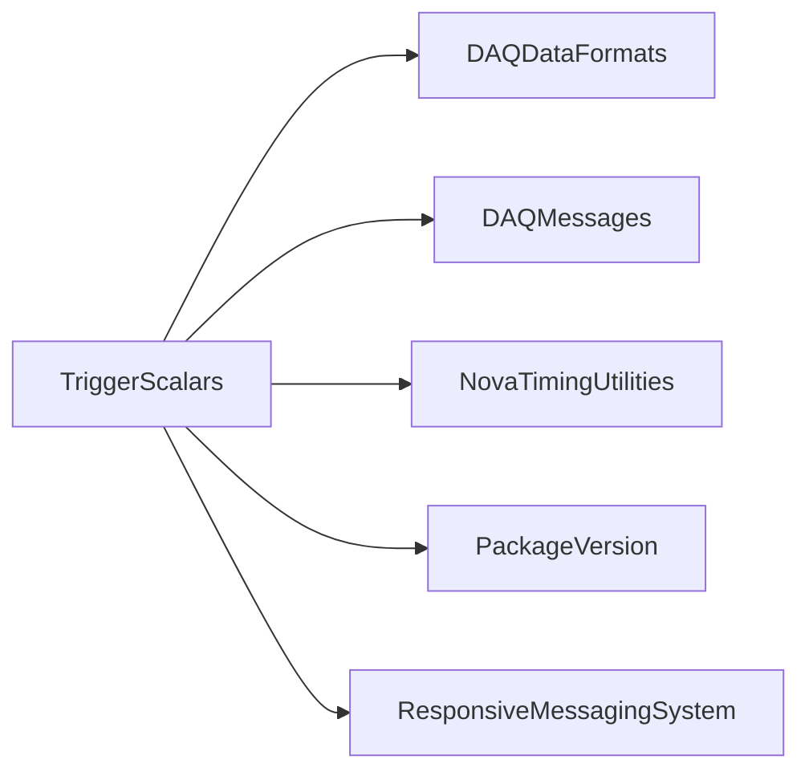

# TriggerScalars

Qt trigger scalar displays, listener/examiner threads, and visual counter widgets.

## Identity and scope

Repository: [NovaDAQ/TriggerScalars](https://github.com/NovaDAQ/TriggerScalars) · Reviewed commit: `2d3679cbd6bc36131299921fb51850ea5091cfd5` · Domain: **Monitoring**.

Tracked files: **285**. Production deployment and owner are **unconfirmed**.

## Operation

Match trigger definitions and mailbox/partition selection. Check update freshness, count resets, and rate calculation interval; a frozen display is not evidence that triggers stopped.

For prerequisites, safe start/stop sequencing, health checks, and rollback see the [operations guide](../operations/index.md).

## Build and integration

This package uses the SRT/SoftRelTools release context. A standalone `make` in a fresh checkout is not a supported build recipe unless the required context is already configured. See [build and release](../operations/build.md).

| Build definition |
| --- |
| [GNUmakefile](https://github.com/NovaDAQ/TriggerScalars/blob/2d3679cbd6bc36131299921fb51850ea5091cfd5/GNUmakefile) |
| [cxx/GNUmakefile](https://github.com/NovaDAQ/TriggerScalars/blob/2d3679cbd6bc36131299921fb51850ea5091cfd5/cxx/GNUmakefile) |
| [cxx/src/GNUmakefile](https://github.com/NovaDAQ/TriggerScalars/blob/2d3679cbd6bc36131299921fb51850ea5091cfd5/cxx/src/GNUmakefile) |
| [cxx/test/GNUmakefile](https://github.com/NovaDAQ/TriggerScalars/blob/2d3679cbd6bc36131299921fb51850ea5091cfd5/cxx/test/GNUmakefile) |
| [cxx/unittest/GNUmakefile](https://github.com/NovaDAQ/TriggerScalars/blob/2d3679cbd6bc36131299921fb51850ea5091cfd5/cxx/unittest/GNUmakefile) |
| [java/GNUmakefile](https://github.com/NovaDAQ/TriggerScalars/blob/2d3679cbd6bc36131299921fb51850ea5091cfd5/java/GNUmakefile) |
| [java/src/GNUmakefile](https://github.com/NovaDAQ/TriggerScalars/blob/2d3679cbd6bc36131299921fb51850ea5091cfd5/java/src/GNUmakefile) |
| [java/test/GNUmakefile](https://github.com/NovaDAQ/TriggerScalars/blob/2d3679cbd6bc36131299921fb51850ea5091cfd5/java/test/GNUmakefile) |
| [java/unittest/GNUmakefile](https://github.com/NovaDAQ/TriggerScalars/blob/2d3679cbd6bc36131299921fb51850ea5091cfd5/java/unittest/GNUmakefile) |

## Entry points

These are source entry points or operational scripts found statically. Installation names and enabled targets depend on the build/configuration; listing a script does not establish that it is deployed.

| Source |
| --- |
| [cxx/src/TriggerScalars.cc](https://github.com/NovaDAQ/TriggerScalars/blob/2d3679cbd6bc36131299921fb51850ea5091cfd5/cxx/src/TriggerScalars.cc) |

## Interfaces

Headers and declared types form the API navigation map. Follow the source for method signatures, ownership, units, and error contracts. Generated DDS/XSD types are built from the schemas in the next section.

| Header | Declared types |
| --- | --- |
| [cxx/src/QLed.h](https://github.com/NovaDAQ/TriggerScalars/blob/2d3679cbd6bc36131299921fb51850ea5091cfd5/cxx/src/QLed.h) | `QColor`, `QDESIGNER_WIDGET_EXPORT`, `QSvgRenderer`, `ledColor`, `ledShape` |
| [cxx/src/ScalarTitleBar.h](https://github.com/NovaDAQ/TriggerScalars/blob/2d3679cbd6bc36131299921fb51850ea5091cfd5/cxx/src/ScalarTitleBar.h) | `ScalarTitleBar` |
| [cxx/src/TriggerBlock.h](https://github.com/NovaDAQ/TriggerScalars/blob/2d3679cbd6bc36131299921fb51850ea5091cfd5/cxx/src/TriggerBlock.h) | `triggerBlock` |
| [cxx/src/TriggerDisplay.h](https://github.com/NovaDAQ/TriggerScalars/blob/2d3679cbd6bc36131299921fb51850ea5091cfd5/cxx/src/TriggerDisplay.h) | `BankConfigEntry`, `ConfigEntry`, `DisplaySizes`, `ThemeStyles`, `TriggerDisplay` |
| [cxx/src/TriggerExamineThread.h](https://github.com/NovaDAQ/TriggerScalars/blob/2d3679cbd6bc36131299921fb51850ea5091cfd5/cxx/src/TriggerExamineThread.h) | `TriggerBlock`, `TriggerExamineThread` |
| [cxx/src/TriggerListenThread.h](https://github.com/NovaDAQ/TriggerScalars/blob/2d3679cbd6bc36131299921fb51850ea5091cfd5/cxx/src/TriggerListenThread.h) | `TriggerListenThread` |
| [cxx/src/VissualScalar.h](https://github.com/NovaDAQ/TriggerScalars/blob/2d3679cbd6bc36131299921fb51850ea5091cfd5/cxx/src/VissualScalar.h) | `ALARM_STATES`, `VissualScalar` |
| [cxx/src/VissualScalarBank.h](https://github.com/NovaDAQ/TriggerScalars/blob/2d3679cbd6bc36131299921fb51850ea5091cfd5/cxx/src/VissualScalarBank.h) | `VissualScalarBank` |
| [cxx/src/qdisplay.h](https://github.com/NovaDAQ/TriggerScalars/blob/2d3679cbd6bc36131299921fb51850ea5091cfd5/cxx/src/qdisplay.h) | `DisplaySize`, `DisplayType`, `QDisplay` |
| [cxx/src/version.h](https://github.com/NovaDAQ/TriggerScalars/blob/2d3679cbd6bc36131299921fb51850ea5091cfd5/cxx/src/version.h) | Functions, constants, or templates |

## Configuration and data contracts

| Source artifact |
| --- |
| [config/scalar_config.xml](https://github.com/NovaDAQ/TriggerScalars/blob/2d3679cbd6bc36131299921fb51850ea5091cfd5/config/scalar_config.xml) |
| [config/scalar_config_base.xml](https://github.com/NovaDAQ/TriggerScalars/blob/2d3679cbd6bc36131299921fb51850ea5091cfd5/config/scalar_config_base.xml) |
| [config/scalar_config_beam_only.xml](https://github.com/NovaDAQ/TriggerScalars/blob/2d3679cbd6bc36131299921fb51850ea5091cfd5/config/scalar_config_beam_only.xml) |
| [config/scalar_config_ddt_only.xml](https://github.com/NovaDAQ/TriggerScalars/blob/2d3679cbd6bc36131299921fb51850ea5091cfd5/config/scalar_config_ddt_only.xml) |
| [config/scalar_config_default.xml](https://github.com/NovaDAQ/TriggerScalars/blob/2d3679cbd6bc36131299921fb51850ea5091cfd5/config/scalar_config_default.xml) |
| [config/scalar_config_far_det.xml](https://github.com/NovaDAQ/TriggerScalars/blob/2d3679cbd6bc36131299921fb51850ea5091cfd5/config/scalar_config_far_det.xml) |
| [config/scalar_config_near_det.xml](https://github.com/NovaDAQ/TriggerScalars/blob/2d3679cbd6bc36131299921fb51850ea5091cfd5/config/scalar_config_near_det.xml) |
| [config/scalar_config_summary.xml](https://github.com/NovaDAQ/TriggerScalars/blob/2d3679cbd6bc36131299921fb51850ea5091cfd5/config/scalar_config_summary.xml) |

## Environment and external dependencies

Environment names below are literal lookups found in source, not a guarantee that every value is mandatory. No environment values or credentials are copied into this documentation.

No literal environment lookup was identified by this scan; shell setup scripts may still provide required values.

Unresolved/non-package include roots (some are system or generated headers; this is not a package-manager lockfile):

| Include root | Evidence |
| --- | --- |
| `Qt` | [cxx/src/QLed.cpp:20](https://github.com/NovaDAQ/TriggerScalars/blob/2d3679cbd6bc36131299921fb51850ea5091cfd5/cxx/src/QLed.cpp#L20) |
| `QtCore` | [cxx/src/QLed.cpp:16](https://github.com/NovaDAQ/TriggerScalars/blob/2d3679cbd6bc36131299921fb51850ea5091cfd5/cxx/src/QLed.cpp#L16) |
| `QtDesigner` | [cxx/src/QLed.h:21](https://github.com/NovaDAQ/TriggerScalars/blob/2d3679cbd6bc36131299921fb51850ea5091cfd5/cxx/src/QLed.h#L21) |
| `QtGui` | [cxx/src/QLed.cpp:17](https://github.com/NovaDAQ/TriggerScalars/blob/2d3679cbd6bc36131299921fb51850ea5091cfd5/cxx/src/QLed.cpp#L17) |
| `QtNetwork` | [cxx/src/TriggerExamineThread.cpp:4](https://github.com/NovaDAQ/TriggerScalars/blob/2d3679cbd6bc36131299921fb51850ea5091cfd5/cxx/src/TriggerExamineThread.cpp#L4) |
| `QtSvg` | [cxx/src/QLed.cpp:21](https://github.com/NovaDAQ/TriggerScalars/blob/2d3679cbd6bc36131299921fb51850ea5091cfd5/cxx/src/QLed.cpp#L21) |
| `QtXml` | [cxx/src/TriggerDisplay.cpp:16](https://github.com/NovaDAQ/TriggerScalars/blob/2d3679cbd6bc36131299921fb51850ea5091cfd5/cxx/src/TriggerDisplay.cpp#L16) |
| `boost` | [cxx/src/TriggerListenThread.cpp:23](https://github.com/NovaDAQ/TriggerScalars/blob/2d3679cbd6bc36131299921fb51850ea5091cfd5/cxx/src/TriggerListenThread.cpp#L23) |
| `messagefacility` | [cxx/src/TriggerDisplay.cpp:22](https://github.com/NovaDAQ/TriggerScalars/blob/2d3679cbd6bc36131299921fb51850ea5091cfd5/cxx/src/TriggerDisplay.cpp#L22) |
| `sys` | [cxx/src/TriggerDisplay.cpp:1](https://github.com/NovaDAQ/TriggerScalars/blob/2d3679cbd6bc36131299921fb51850ea5091cfd5/cxx/src/TriggerDisplay.cpp#L1) |

## Package dependencies

Arrow direction is **consumer → dependency**. This diagram includes source/build/runtime relationships and excludes test-only, release-membership, and build-tool edges. Conditional branches are not evaluated.

| Dependency | Relationship | Evidence |
| --- | --- | --- |
| [DAQDataFormats](DAQDataFormats.md) | build link | [cxx/src/GNUmakefile:37](https://github.com/NovaDAQ/TriggerScalars/blob/2d3679cbd6bc36131299921fb51850ea5091cfd5/cxx/src/GNUmakefile#L37) |
| [DAQDataFormats](DAQDataFormats.md) | source include | [cxx/src/TriggerDisplay.cpp:19](https://github.com/NovaDAQ/TriggerScalars/blob/2d3679cbd6bc36131299921fb51850ea5091cfd5/cxx/src/TriggerDisplay.cpp#L19) |
| [DAQMessages](DAQMessages.md) | build link | [cxx/src/GNUmakefile:37](https://github.com/NovaDAQ/TriggerScalars/blob/2d3679cbd6bc36131299921fb51850ea5091cfd5/cxx/src/GNUmakefile#L37) |
| [DAQMessages](DAQMessages.md) | source include | [cxx/src/TriggerListenThread.cpp:22](https://github.com/NovaDAQ/TriggerScalars/blob/2d3679cbd6bc36131299921fb51850ea5091cfd5/cxx/src/TriggerListenThread.cpp#L22) |
| [NovaTimingUtilities](NovaTimingUtilities.md) | build link | [cxx/src/GNUmakefile:37](https://github.com/NovaDAQ/TriggerScalars/blob/2d3679cbd6bc36131299921fb51850ea5091cfd5/cxx/src/GNUmakefile#L37) |
| [NovaTimingUtilities](NovaTimingUtilities.md) | source include | [cxx/src/TriggerListenThread.cpp:21](https://github.com/NovaDAQ/TriggerScalars/blob/2d3679cbd6bc36131299921fb51850ea5091cfd5/cxx/src/TriggerListenThread.cpp#L21) |
| [PackageVersion](PackageVersion.md) | build link | [cxx/src/GNUmakefile:37](https://github.com/NovaDAQ/TriggerScalars/blob/2d3679cbd6bc36131299921fb51850ea5091cfd5/cxx/src/GNUmakefile#L37) |
| [PackageVersion](PackageVersion.md) | source include | [cxx/src/version.h:28](https://github.com/NovaDAQ/TriggerScalars/blob/2d3679cbd6bc36131299921fb51850ea5091cfd5/cxx/src/version.h#L28) |
| [ResponsiveMessagingSystem](ResponsiveMessagingSystem.md) | source include | [cxx/src/TriggerListenThread.cpp:9](https://github.com/NovaDAQ/TriggerScalars/blob/2d3679cbd6bc36131299921fb51850ea5091cfd5/cxx/src/TriggerListenThread.cpp#L9) |
| [SRT_ONLINE](SRT_ONLINE.md) | build tool | [GNUmakefile:10](https://github.com/NovaDAQ/TriggerScalars/blob/2d3679cbd6bc36131299921fb51850ea5091cfd5/GNUmakefile#L10) |

Direct consumers: None resolved in this snapshot.

Explore upstream/downstream impact in the [dependency explorer](../architecture/explorer.md).

## Validation and review

Static analysis attempted **9 C/C++ translation units**, **0 shell scripts**, and parsed **0 Python files**. Counts are tool input coverage, not proof of successful compilation or exhaustive review. Source/build/configuration inventories and the operating surface were also assessed.

No actionable defect was confirmed for this package in this review. This is a bounded review result, not a clean bill of health; unvalidated analyzer diagnostics were not filed as bugs.

Existing test/example sources (not executed against production):

No test/example source identified in the scoped inventory.

## Existing documentation

No package README/manual identified in the scoped inventory. Use this page and the source interfaces above.
